# CLOUD9 환경 만들기
이 실습은 클라우드 기반의 통합 개발 환경 (IDE)이다 AWS Cloud9 을 이용하여 거의 모든 작업을 Cloud9 위에서 명령 줄로합니다.

이 장에서는 실습에 사용하는 Cloud9 환경을 만들 수 있습니다.

## CLOUD9 환경 만들기
이 절에서는이 실습의 작업 환경이되는 Cloud9 환경을 만듭니다.

관리 콘솔에서 " 서비스 "에서 " 개발자 도구 "카테고리의 " Cloud9 "을 선택합니다.

<!--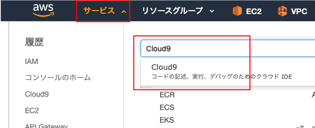-->

지역이 `버지니아 북부` 임을 확인합니다. 그렇지 지역으로 되어있는 경우는 `버지니아 북부` 로 변경합니다.

<!--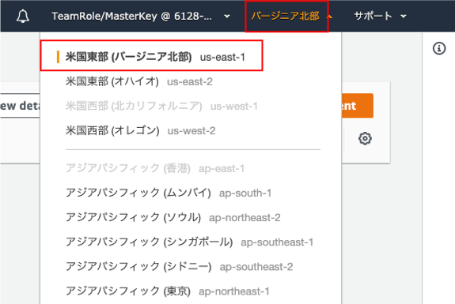-->

```
도쿄 등 Amazon EKS 서비스가 제공되고있다다른 지역하지만 실습 실시 가능합니다. 이 경우 다음 단계에서 적절한 지역을 대체하십시오.
```

- "Create environment" 버튼을 클릭합니다.


- "Name environment" 화면에서 "Name" 에 원하는 이름을 지정합니다. 예로서 `ekshandson_개인-ID` 로서, "Next step" 버튼을 클릭합니다.

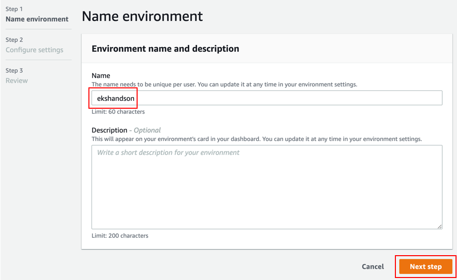

- "Configure settings" 화면에서 아래의 기본 상태 "Next step" 버튼을 클릭합니다.

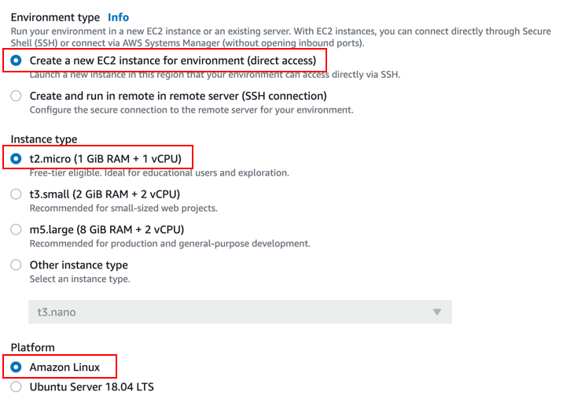

- `Review` 화면에서 선택한 내용을 확인하고 화면 오른쪽 하단의 "Create environment" 버튼을 클릭합니다.

```
기본 설정은 Cloud9은 기본 VPC에서 시작합니다. 모든 VPC에서 시작하는 것도 가능하지만, Public 서브넷을 지정해야합니다.
```

Cloud9가 시작 올 때까지 기다립니다 (약 2 분). 다음과 같은 화면이 열리면 시작이 완료됩니다.

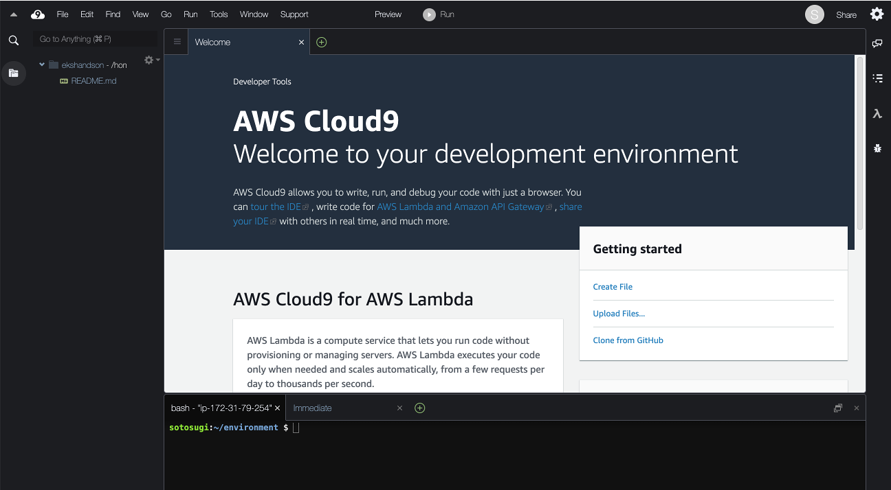

```
환경에 따라 Cloud9의 컬러 테마가 위의 스크린 샷과 다를 수 있습니다. 화면 상단의 메뉴에서 " View> Themes "에서 원하는 테마를 변경할 수 있습니다. 이 실습 텍스트의 스크린 샷과 테마를 맞추고 싶은 경우 " View> Themes '에서' UI Themes> Jett Dark '를 선택하십시오.
```

## IAM 역할 만들기
이 절에서는 Cloud9 환경을 호스팅하는 EC2 인스턴스에 할당 IAM 역할을 생성합니다.

- Cloud9 왼쪽의 구름 모양의 아이콘 (테마에 따라 아이콘이 아니라 "AWS Cloud9" 라는 문자열)을 클릭하고 메뉴에서 "Go To Your Dashboad" 를 클릭하십시오. 다른 탭에서 AWS 관리 콘솔을 엽니다.

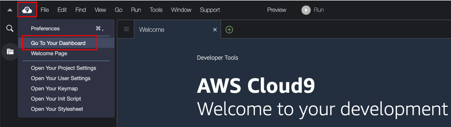

- 관리 콘솔에서 "서비스" 에서 "보안, ID 및 컴플라이언스" "카테고리의" "IAM" 를 선택합니다.

<!--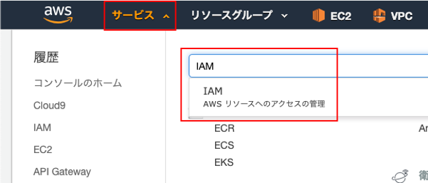-->

- 왼쪽 메뉴에서 "역할" 을 선택합니다.

<!--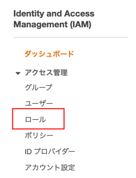-->

- "역할 만들기" 버튼을 클릭합니다.

<!--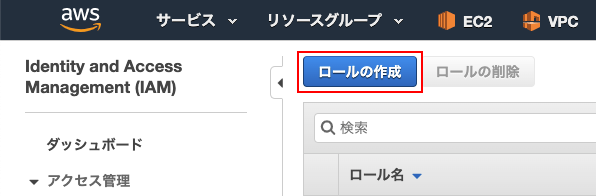-->

- "AWS 서비스" 와 "EC2" 를 선택하고 다음 단계 : 권한 버튼을 클릭합니다.

<!--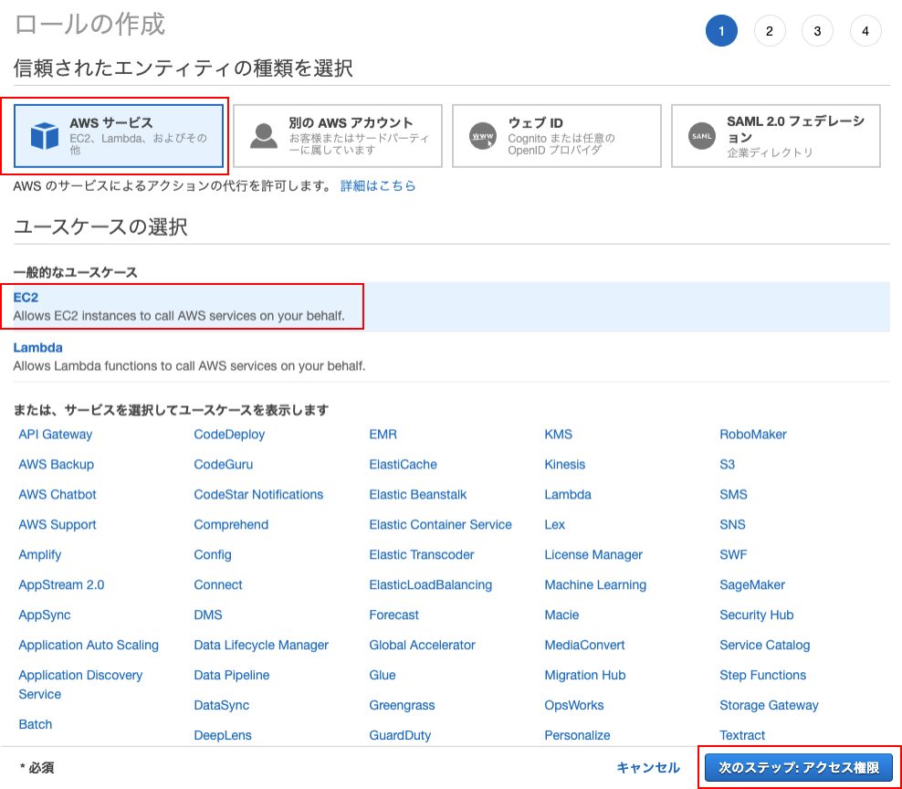-->

- AdministratorAccess에 체크를 넣어 "다음 단계 : 태그" 버튼을 클릭합니다.

<!---->

- 태그는 그대로 하고 "다음 단계 : 확인" 버튼을 클릭합니다.

- Role 에 어떤 이름을 붙입니다. 예 ekshandson-admin로서 "역할 만들기" 버튼을 클릭합니다.

<!--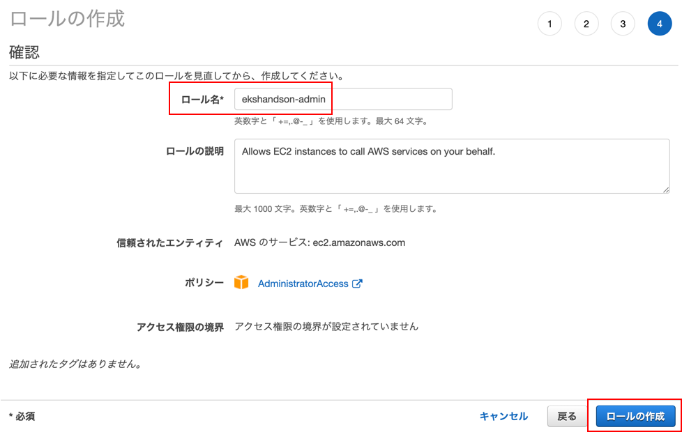-->

- 역할 만들기가 성공했는지 확인합니다.

<!--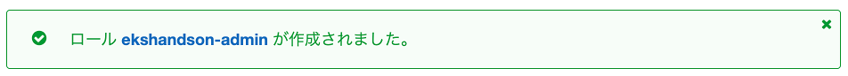-->

## IAM 역할 할당
이 절에서는 앞 절에서 만든 IAM 역할을 Cloud9 환경을 호스팅하는 EC2 인스턴스에 할당합니다.

- 관리 콘솔에서 "서비스"에서 "컴퓨팅" 카테고리의 "EC2" 를 선택합니다.

<!--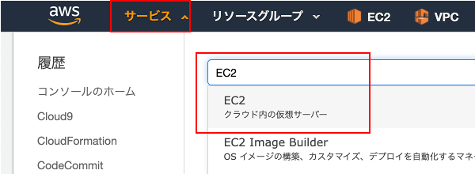-->

- 왼쪽 메뉴에서 "인스턴스" 를 선택합니다.

<!--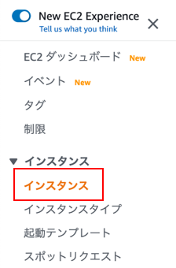-->

- aws-cloud9-<Cloud9 환경이름 > 로 시작하는 이름의 인스턴스가 Cloud9의 인스턴스입니다.

<!--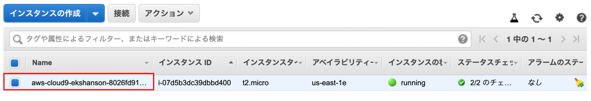-->

- Cloud9의 인스턴스에 체크하고 `액션` 버튼을 클릭하여 "인스턴스의 설정」의 「IAM 역할 할당 / 대체" 를 선택합니다.

<!--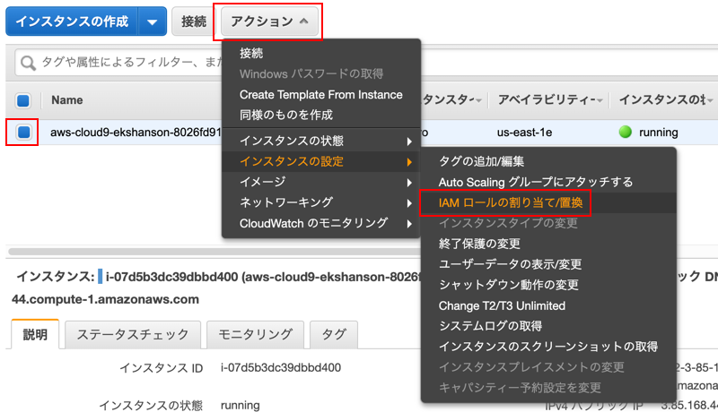-->

- 이전 단계에서 만든 IAM 역할 (ekshandson-admin)을 선택하고 " 적용 "버튼을 클릭합니다.

<!---->

- 할당이 성공하면 '닫기' 버튼을 클릭합니다.

<!---->

이상에서 IAM 역할 만들기 및 할당이 완료됩니다. Cloud9을 열려있는 브라우저 탭으로 돌아와주세요.

## 임시 인증 비활성화
이 절에서는 Cloud9의 설정을 변경하고 AWS 관리 임시 인증 (인증 정보) 기능을 비활성화합니다.

```
Cloud9은 IAM 사용자의 임시 인증을 자동으로 설정하는 기능이 있는데,이 임시 인증?는 IAM 등의 일부 작업에 제한이 있기 때문에이 임시 자격은 무효화하고 EC2 인스턴스에 할당 된 IAM 역할이 사용되도록합니다.
```

Cloud9 화면에서 오른쪽 상단의 톱니 바퀴 모양의 아이콘을 클릭합니다.

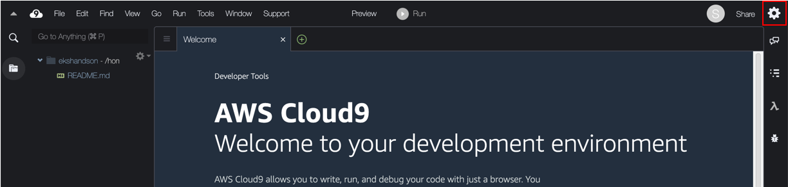

" AWS Settings "메뉴를 열고 " AWS managed temporary credentials "을 비활성화합니다.

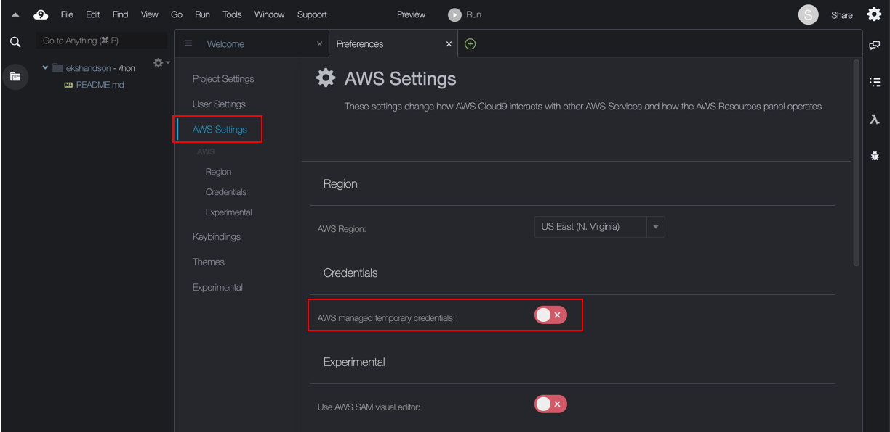

설정을 변경 한 후 " Preferences "탭을 닫습니다.

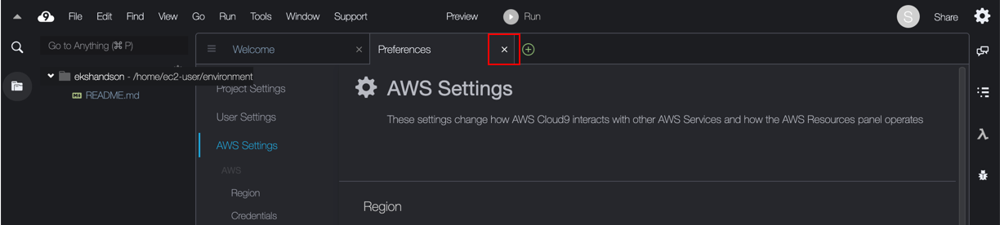

## AWS CLI의 초기 설정
이 절에서는 AWS CLI의 초기 설정을합니다.

```
이 실습은 주로 터미널에서 작업하기 때문에, 화면 하단의 터미널 경계를 위로 드래그하여 터미널의 영역을 자유롭게 펼쳐주세요.
```

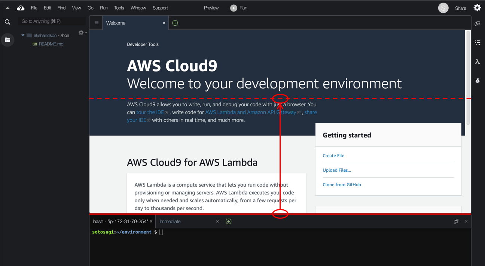

```
이 실습 텍스트는 명령 필드의 오른쪽 상단에있는 아이콘을 클릭하면 명령을 클립 보드에 복사 할 수 있습니다.
```

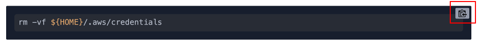

### 인증 삭제
EC2 인스턴스에 할당 된 IAM 역할이 사용되는 것을 보장하기 위해, 인증 파일을 삭제합니다. 여기까지 절차대로 수행하는 경우 인증 파일이 존재하지 않는 것이므로, 이것은 만약을위한 작업입니다.

화면 하단의 터미널에서 다음 명령을 실행하십시오.

```
rm -vf ${HOME}/.aws/credentials
```

AWS CLI 버전 확인
AWS CLI 버전을 확인합니다.

```
aws --version
```

버전 1.18.17이상인지 확인하십시오.

```
aws-cli/1.18.97 Python/3.6.10 Linux/4.14.181-108.257.amzn1.x86_64 botocore/1.17.20
```

### 지역 설정
AWS CLI의 default프로필에 영역을 설정합니다.

```
AWS_REGION="us-east-1"
aws configure set default.region ${AWS_REGION}
```

설정된 지역을 확인합니다.

```
aws configure get default.region
```

```
us-east-1
```

### IAM 신원 확인
다음 명령을 실행하고 출력에 Cloud9 EC2 인스턴스에 할당 된 IAM 역할 이름 ( ekshandson-admin)이 표시되어 있는지 확인합니다.

```
aws sts get-caller-identity
```

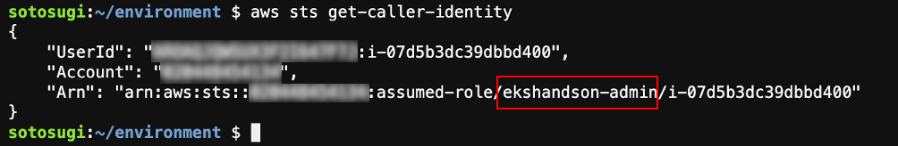

```
할당 된 IAM 역할 이름이 출력되지 않는 경우는이 장의 IAM 역할 만들기이후의 과정을 검토하고 Cloud9 EC2 인스턴스에 IAM 역할을 할당 있는지, Cloud9의 AWS 관리 임시 인증이 비활성화되어 있는지 확인하십시오.
```
