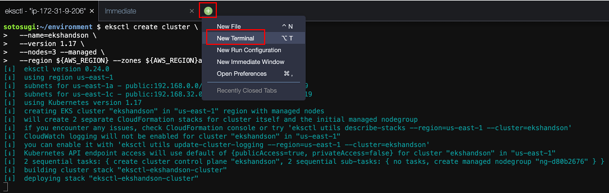

# 클러스터 작성
이 장에서는 [eksctl](https://eksctl.io/) 명령을 사용하여 EKS 클러스터를 작성합시다.

eksctl는 AWS에서 공식적으로 지원하는 [Amazon EKS](https://aws.amazon.com/jp/eks/) 에서 Kubernetes 클러스터 생성 및 관리를 위한 간단한 명령행 유틸리티입니다.

## EKSCTL과 KUBECTL의 도입
이 절에서는 Kubernetes 클러스터 자체를 만드는 데 사용하는 eksctl 명령과 만든 Kubernetes 클러스터 작업에 사용하는 kubectl 명령을 설치합니다.

### eksctl
eksctl 명령을 설치합니다.

```
curl -L "https://github.com/weaveworks/eksctl/releases/latest/download/eksctl_$(uname -s)_amd64.tar.gz" | tar xz -C /tmp
sudo mv /tmp/eksctl /usr/local/bin
```

eksctl명령의 버전을 확인합시다. 0.24.0이상의 버전을 사용하십시오.

```
eksctl version
```

```
0.24.0
```

### kubectl
kubectl명령은 EKS 클러스터 Kubernetes 버전에 맞는 버전을 사용합니다. 각 버전의 다운로드 URL은 아래 링크를 확인하십시오.

- [kubectl 설치](https://docs.aws.amazon.com/ja_jp/eks/latest/userguide/install-kubectl.html)

이 실습에서는 Kubernetes 버전 1.17을 사용하기 때문에 동일한 버전의 kubectl명령을 설치합니다.

```
sudo curl -L -o /usr/local/bin/kubectl https://amazon-eks.s3.us-west-2.amazonaws.com/1.17.7/2020-07-08/bin/linux/amd64/kubectl
sudo chmod +x /usr/local/bin/kubectl
```

kubectl명령의 버전을 확인합시다. 클라이언트 측만의 버전을 확인하려면 --client 플래그를 사용합니다.

```
kubectl version --short --client
```

```
Client Version: v1.17.7-eks-bffbac
```

## 클러스터 작성
이 절에서는eksctl 를 사용하여 EKS 클러스터를 만듭니다.

다음 명령을 실행하여 클러스터를 만듭니다.

```
AWS_REGION=$(aws configure get default.region)
eksctl create cluster \
  --name=ekshandson \
  --version 1.17 \
  --nodes=3 --managed \
  --region ${AWS_REGION} --zones ${AWS_REGION}a,${AWS_REGION}c
```

```
이처럼 클러스터의 이름과 버전 등의 클러스터 구성 옵션을 인수로 전달하는 방법 이외에도 설정을 YAML 파일에 작성하고 인자와 YAML 파일을 지정할 수 있습니다.
```

```
기존 VPC를 사용하여 클러스터를 만들 수 있습니다. 이번에는 eksctl가 새 VPC도 만들고 있습니다. 그 밖에도 다양한 옵션을 설정할 수 있습니다.eksctl 문서을 참조하십시오.
```

클러스터를 작성하고있는 상황이 출력되어갑니다.

```
[ℹ]  eksctl version 0.24.0
[ℹ]  using region us-east-1
[ℹ]  subnets for us-east-1a - public:192.168.0.0/19 private:192.168.64.0/19
[ℹ]  subnets for us-east-1c - public:192.168.32.0/19 private:192.168.96.0/19
[ℹ]  using Kubernetes version 1.17
[ℹ]  creating EKS cluster "ekshandson" in "us-east-1" region with managed nodes
[ℹ]  will create 2 separate CloudFormation stacks for cluster itself and the initial managed nodegroup
[ℹ]  if you encounter any issues, check CloudFormation console or try 'eksctl utils describe-stacks --region=us-east-1 --cluster=ekshandson'
[ℹ]  CloudWatch logging will not be enabled for cluster "ekshandson" in "us-east-1"
[ℹ]  you can enable it with 'eksctl utils update-cluster-logging --region=us-east-1 --cluster=ekshandson'
[ℹ]  Kubernetes API endpoint access will use default of {publicAccess=true, privateAccess=false} for cluster "ekshandson" in "us-east-1"
[ℹ]  2 sequential tasks: { create cluster control plane "ekshandson", 2 sequential sub-tasks: { no tasks, create managed nodegroup "ng-3902f9fb" } }
[ℹ]  building cluster stack "eksctl-ekshandson-cluster"
[ℹ]  deploying stack "eksctl-ekshandson-cluster"
[ℹ]  building managed nodegroup stack "eksctl-ekshandson-nodegroup-ng-3902f9fb"
[ℹ]  deploying stack "eksctl-ekshandson-nodegroup-ng-3902f9fb"
[ℹ]  waiting for the control plane availability...
[✔]  saved kubeconfig as "/home/ec2-user/.kube/config"
[ℹ]  no tasks
[✔]  all EKS cluster resources for "ekshandson" have been created
[ℹ]  nodegroup "ng-3902f9fb" has 3 node(s)
[ℹ]  node "ip-192-168-15-124.ec2.internal" is ready
[ℹ]  node "ip-192-168-26-85.ec2.internal" is ready
[ℹ]  node "ip-192-168-48-84.ec2.internal" is ready
[ℹ]  waiting for at least 3 node(s) to become ready in "ng-3902f9fb"
[ℹ]  nodegroup "ng-3902f9fb" has 3 node(s)
[ℹ]  node "ip-192-168-15-124.ec2.internal" is ready
[ℹ]  node "ip-192-168-26-85.ec2.internal" is ready
[ℹ]  node "ip-192-168-48-84.ec2.internal" is ready
[ℹ]  kubectl command should work with "/home/ec2-user/.kube/config", try 'kubectl get nodes'
[✔]  EKS cluster "ekshandson" in "us-east-1" region is ready
```

eksctl은 CloudFormation을 사용해 VPC와 EKS 클러스터의 컨트롤 플레인과 작업자 노드의 Auto Scaling Group 등의 AWS 리소스를 만들고 있습니다. CloudFormation 콘솔을 열고 eksctl 만든 CloudFormation 스택을 확인해주세요.

EKS cluster "ekshandson_개인-ID" in "us-east-1" region is ready이 표시되면 클러스터의 생성이 완료됩니다. 클러스터 작성에 오류가 발생하면 다음 절을 확인하십시오.

- [클러스터 생성 문제 해결](https://eks-for-aws-summit-online.workshop.aws/020_create_cluster/90_troubleshooting.html)

클러스터 작성이 완료 될 때까지 시간이 걸립니다 (약 20 분). 이전에 다른 작업을하기 위해 새로운 터미널을 다른 탭에서 엽니합시다.



## 편리한 도구 및 설정
클러스터가 생성되는 것을 기다리는 동안 Kubernetes 이용시 자주 사용되는 몇 가지 유용한 도구의 도입과 명령 보완 설정을 해 둡시다.

### jq와 bash-completion
json 데이터를 처리하는 유용한 명령이다 jq및 bash 쉘에서 명령의 보완을 해준다 bash-completion을 설치합니다.

```
sudo yum -y install jq bash-completion
```

### docker 명령 보완
docker 명령의 보완을 사용합니다.

```
sudo curl -L -o /etc/bash_completion.d/docker https://raw.githubusercontent.com/docker/cli/master/contrib/completion/bash/docker
```

### docker-compose의 도입과 명령 보완

docker-compose 명령을 도입하고 명령의 보완을 사용합니다.

```
sudo curl -L -o /usr/local/bin/docker-compose "https://github.com/docker/compose/releases/download/1.26.2/docker-compose-$(uname -s)-$(uname -m)"
sudo chmod +x /usr/local/bin/docker-compose
sudo curl -L -o /etc/bash_completion.d/docker-compose https://raw.githubusercontent.com/docker/compose/1.26.2/contrib/completion/bash/docker-compose
```

### kubectl 명령 보완
kubectl 명령 보완을 사용합니다.

```
kubectl completion bash > kubectl_completion
sudo mv kubectl_completion /etc/bash_completion.d/kubectl
```

### eksctl 명령 보완
eksctl 명령 보완을 사용합니다.

```
eksctl completion bash > eksctl_completion
sudo mv eksctl_completion /etc/bash_completion.d/eksctl
```


### k (별칭)
k=kubectl 별칭 설정도 추천합니다.

```
cat <<"EOT" >> ${HOME}/.bash_profile

alias k="kubectl"
complete -o default -F __start_kubectl k
EOT
```

### kube-ps1
현재 kubectl 컨텍스트 및 Namespace를 프롬프트에 표시 해주는 편리한 도구입니다.kube-ps1 를 도입합니다.

```
git clone https://github.com/jonmosco/kube-ps1.git ~/.kube-ps1
cat <<"EOT" >> ~/.bash_profile

source ~/.kube-ps1/kube-ps1.sh
function get_cluster_short() {
  echo "$1" | cut -d . -f1
}
KUBE_PS1_CLUSTER_FUNCTION=get_cluster_short
KUBE_PS1_SUFFIX=') '
PS1='$(kube_ps1)'$PS1
EOT
```

### kubectx / kubens
kubectl 컨텍스트와 Namespace의 전환을 용이하게 해주는 유용한 도구이며,kubectx 와 kubens을 소개합니다.

```
git clone https://github.com/ahmetb/kubectx.git ~/.kubectx
sudo ln -sf ~/.kubectx/completion/kubens.bash /etc/bash_completion.d/kubens
sudo ln -sf ~/.kubectx/completion/kubectx.bash /etc/bash_completion.d/kubectx
cat <<"EOT" >> ~/.bash_profile

export PATH=~/.kubectx:$PATH
EOT
```

### stern
컨테이너의 로그를 확인하는 데 유용한 도구이며, stern 를 도입합니다.

```
sudo curl -L -o /usr/local/bin/stern https://github.com/wercker/stern/releases/download/1.11.0/stern_linux_amd64
sudo chmod +x /usr/local/bin/stern
```

### 설정로드
~/.bash_profile 다음에 추가 설정을 활성화하기 위해 현재 터미널의 탭을 닫고 새 터미널의 탭을 열어주십시오.

```
source ~/.bash_profile 라고 명령 보완이 성공적으로 효과가없는 경우가 있으므로 터미널을 다시 열도록하십시오.
```

```
이 실습에서는 실행 명령은 텍스트에서 복사 및 붙여 넣기 할 수 있기 때문에 명령 보완이나 별칭을 사용할 필요는 없지만, 실제로 자신이 명령을 입력하는 경우에는 강력한 도움이됩니다.
```

## 클러스터 생성 문제 해결
이 절에서는 클러스터의 생성에 어떠한 에러가 발생했을 경우의 대응의 힌트가되는 정보를 제공합니다.

문제점 해결 힌트가되는 정보는 터미널에 eksctl 로그 이외에서는 eksctl 의해 실행되는 CloudFormation 스택의 이벤트입니다. 관리 콘솔에서 CloudFormation 서비스를 열고 eksctl-로 시작하는 이름의 스택 이벤트를 확인하십시오.

### Availability Zone 리소스 부족
eksctl 로그에 다음과 같은 로그가 출력 된 경우, 컨트롤 플레인을 만들 때 선택한 Availability Zone의 AWS 측 리소스가 부족합니다. 이 예에서는 us-east-1e 자원이 부족합니다.

```
[✖]  AWS::EKS::Cluster/ControlPlane: CREATE_FAILED – "Cannot create cluster 'ekshandson' because us-east-1e, the targeted availability zone, does not currently have sufficient capacity to support the cluster. Retry and choose from these availability zones: us-east-1a, us-east-1b, us-east-1c, us-east-1d, us-east-1f (Service: AmazonEKS; Status Code: 400; Error Code: UnsupportedAvailabilityZoneException; Request ID: 91047846-3fdf-45bc-b667-4c3cc251f3af)"
```

먼저 CloudFormation 콘솔에서 실패한 스택을 제거하십시오.

삭제가 완료되면 자원 부족이 아닌 Availability Zone을 명시적으로 두 개를 지정하여 클러스터를 만듭니다.

```
AWS_REGION=$(aws configure get default.region)
eksctl create cluster \
  --name=ekshandson \
  --version 1.17 \
  --nodes=3 --managed \
  --region ${AWS_REGION} --zones ${AWS_REGION}a,${AWS_REGION}c
```

### AWS CLI 버전이 오래된
eksctl 로그에 다음과 같은 로그가 나온 경우 AWS CLI 버전이 오래된 수 있습니다. AWS CLI 버전 1.18.17이하의 경우는 새로운 버전의 AWS CLI가 필요합니다.

```
[✖]  unable to use kubectl with the EKS cluster (check 'kubectl version'): usage: aws [options] <command> <subcommand> [<subcommand> ...] [parameters]
To see help text, you can run:

  aws help
  aws <command> help
  aws <command> <subcommand> help
aws: error: argument operation: Invalid choice, valid choices are:

create-cluster                           | delete-cluster                          
describe-cluster                         | describe-update                         
list-clusters                            | list-updates                            
update-cluster-version                   | update-kubeconfig                       
wait                                     | help                                    
Unable to connect to the server: getting credentials: exec: exit status 2
```

최신 AWS CLI를 설치합시다.

```
sudo pip install awscli
```

.bash_profile 를 읽어주십시오.

```
. ~/.bash_profile
```

다시 AWS CLI 버전을 확인합니다.

```
aws --version
```

버전 1.18.17이상인지 확인하십시오.

```
aws-cli/1.18.94 Python/3.6.10 Linux/4.14.181-108.257.amzn1.x86_64 botocore/1.17.17
```

원래 도입된 AWS CLI는 yum으로 설치되어 /usr/bin/aws설치되어 있습니다. pip로 설치 한 AWS CLI는 /usr/local/bin/aws설치됩니다.

### IAM 역할이 사용되지 않은
eksctl 로그 권한에 대한 메시지가 나온 경우, 혹은 kubeconfig작성 후 초과 한 경우 Cloud9 임시 자격 증명으로 실행되어있을 수 있습니다.

```
[✖]  creating CloudFormation stack "eksctl-ekshandson5-cluster": AccessDenied: User: arn:aws:sts::343914493334:assumed-role/TeamRole/MasterKey is not authorized to perform: cloudformation:CreateStack on resource: arn:aws:cloudformation:us-east-1:343914493334:stack/eksctl-ekshandson5-cluster/*
        status code: 403, request id: 39b1d97e-c814-4166-b688-71a5237624a9
```

```
[✔]  all EKS cluster resources for "ekshandson" have been created
[✔]  saved kubeconfig as "/home/ec2-user/.kube/config"
Error: timed out waiting for control plane "ekshandson" after 25m0s
```

제 1 장 IAM 역할 만들기이후의 과정을 검토하고 Cloud9 EC2 인스턴스에 IAM 역할을 할당 있는지, Cloud9의 AWS 관리 임시 인증이 비활성화되어 있는지 확인하십시오.
