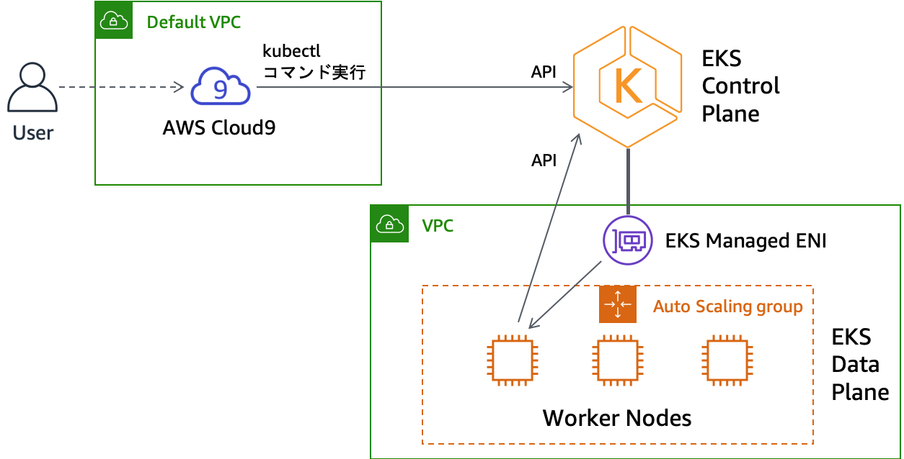
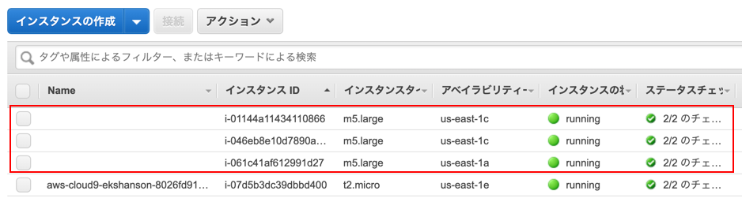
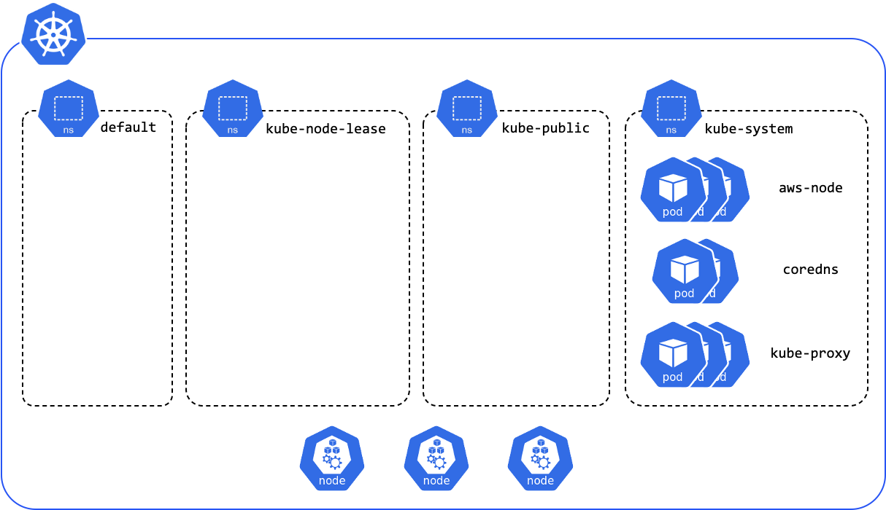

# 클러스터 확인
eksctl에 따르면 Kubernetes 클러스터 작성 완료 한 것입니까?

콘솔에 다음 메시지가 표시되어 있는지 확인하십시오.

```
[✔]  EKS cluster "ekshandson" in "us-east-1" region is ready
```

만약 클러스터 작성에 오류가 발생하면 다음 절을 확인하십시오.

- [클러스터 생성 문제 해결](https://eks-for-aws-summit-online.workshop.aws/020_create_cluster/90_troubleshooting.html)

이 장에서는 Kubernetes 클러스터에 대해 기본적인 kubectl명령을 실행하여 클러스터의 상태를 확인하자.



## 클러스터 확인
이 절에서는 사용자가 작성한 클러스터의 상태를 확인하는 기본적인 kubectl명령을 실행하자.

```
eksctl명령을 실행하여 클러스터를 작성한 터미널은 새 ~/.bash_profile 를 읽어 들이지 않은 상태이므로, 이 탭은 닫고 새 터미널에서 작업하십시오.
```

먼저 클러스터를 확인합시다.

```
eksctl get cluster
```

현재 존재하는 클러스터가 표시됩니다.

```
NAME            REGION
ekshandson      us-east-1
```

클러스터의 기본 정보를 확인합시다.

```
kubectl cluster-info
```

Kubernetes Master 엔드 포인트 등의 정보가 표시됩니다. kubectl명령이 엔드 포인트와 통신을하고 있습니다. 출력에 기재되어있는대로 kubectl cluster-info dump에서 더 자세한 정보를 출력 할 수 있습니다.

```
Kubernetes master is running at https://568F93250F320BBEB0748307F84E77D5.gr7.us-east-1.eks.amazonaws.com
CoreDNS is running at https://568F93250F320BBEB0748307F84E77D5.gr7.us-east-1.eks.amazonaws.com/api/v1/namespaces/kube-system/services/kube-dns:dns/proxy

To further debug and diagnose cluster problems, use 'kubectl cluster-info dump'.
```

## 노드의 확인
클러스터에 속한 노드를 확인합시다. 다음 명령을 실행합니다.

```
kubectl get node
```

3 개의 Worker 노드 (EC2 인스턴스)를 실행하고 있습니다. 또한, 컨트롤 플레인 (Master 노드)은 보이지 않습니다.

```
NAME                             STATUS   ROLES    AGE   VERSION
ip-192-168-15-124.ec2.internal   Ready    <none>   15m   v1.17.7-eks-bffbac
ip-192-168-26-85.ec2.internal    Ready    <none>   15m   v1.17.7-eks-bffbac
ip-192-168-48-84.ec2.internal    Ready    <none>   15m   v1.17.7-eks-bffbac
```

관리 콘솔에서 EC2 콘솔을 열고 인스턴스를 확인하면 3 대의 EC2 인스턴스가 실행중인 것을 확인할 수 있습니다.



EKS 컨트롤 플레인과 작업자 노드의 관계는 AWS 블로그 게시물 "Amazon EKS 작업자 노드의 수수께끼를 푸는 클러스터 네트워크"도 참조하십시오.

```
kubectl describe명령을 사용하면 리소스에 대한 자세한 정보를 확인할 수 있습니다. 노드 (Node 자원)에 대한 자세한 정보를 확인합시다.
```

상기 3 개의 노드 중 하나의 이름 (예를 들어 ip-192-168-15-124.ec2.internal)을 클립 보드에 복사하고 다음 명령을 실행하십시오.

```
kubectl describe node <노드 이름>
```

노드의 용량과 실행중인 Pod 등 각종 정보가 출력됩니다.

```
Name:               ip-192-168-15-124.ec2.internal
Roles:              <none>
Labels:             alpha.eksctl.io/cluster-name=ekshandson
                    alpha.eksctl.io/nodegroup-name=ng-3902f9fb
                    beta.kubernetes.io/arch=amd64
                    beta.kubernetes.io/instance-type=m5.large
                    beta.kubernetes.io/os=linux
                    eks.amazonaws.com/nodegroup=ng-3902f9fb
                    eks.amazonaws.com/nodegroup-image=ami-0bc87a8f0db332ec8
                    failure-domain.beta.kubernetes.io/region=us-east-1
                    failure-domain.beta.kubernetes.io/zone=us-east-1a
                    kubernetes.io/arch=amd64
                    kubernetes.io/hostname=ip-192-168-15-124.ec2.internal
                    kubernetes.io/os=linux
                    node.kubernetes.io/instance-type=m5.large
                    topology.kubernetes.io/region=us-east-1
                    topology.kubernetes.io/zone=us-east-1a
Annotations:        node.alpha.kubernetes.io/ttl: 0
                    volumes.kubernetes.io/controller-managed-attach-detach: true
CreationTimestamp:  Mon, 20 Jul 2020 03:58:06 +0000
Taints:             <none>
Unschedulable:      false
Lease:
  HolderIdentity:  ip-192-168-15-124.ec2.internal
  AcquireTime:     <unset>
  RenewTime:       Mon, 20 Jul 2020 04:24:27 +0000
Conditions:
  Type             Status  LastHeartbeatTime                 LastTransitionTime                Reason                       Message
  ----             ------  -----------------                 ------------------                ------                       -------
  MemoryPressure   False   Mon, 20 Jul 2020 04:24:12 +0000   Mon, 20 Jul 2020 03:58:04 +0000   KubeletHasSufficientMemory   kubelet has sufficient memory available
  DiskPressure     False   Mon, 20 Jul 2020 04:24:12 +0000   Mon, 20 Jul 2020 03:58:04 +0000   KubeletHasNoDiskPressure     kubelet has no disk pressure
  PIDPressure      False   Mon, 20 Jul 2020 04:24:12 +0000   Mon, 20 Jul 2020 03:58:04 +0000   KubeletHasSufficientPID      kubelet has sufficient PID available
  Ready            True    Mon, 20 Jul 2020 04:24:12 +0000   Mon, 20 Jul 2020 03:58:56 +0000   KubeletReady                 kubelet is posting ready status
Addresses:
  InternalIP:   192.168.15.124
  ExternalIP:   3.86.52.83
  Hostname:     ip-192-168-15-124.ec2.internal
  InternalDNS:  ip-192-168-15-124.ec2.internal
  ExternalDNS:  ec2-3-86-52-83.compute-1.amazonaws.com
Capacity:
  attachable-volumes-aws-ebs:  25
  cpu:                         2
  ephemeral-storage:           83873772Ki
  hugepages-1Gi:               0
  hugepages-2Mi:               0
  memory:                      7951036Ki
  pods:                        29
Allocatable:
  attachable-volumes-aws-ebs:  25
  cpu:                         1930m
  ephemeral-storage:           76224326324
  hugepages-1Gi:               0
  hugepages-2Mi:               0
  memory:                      7260860Ki
  pods:                        29
System Info:
  Machine ID:                 ec265b266ab2f3f50c9945775127d67e
  System UUID:                EC265B26-6AB2-F3F5-0C99-45775127D67E
  Boot ID:                    64449de7-4de8-493f-b0c5-484c358bc8d0
  Kernel Version:             4.14.181-142.260.amzn2.x86_64
  OS Image:                   Amazon Linux 2
  Operating System:           linux
  Architecture:               amd64
  Container Runtime Version:  docker://19.3.6
  Kubelet Version:            v1.17.7-eks-bffbac
  Kube-Proxy Version:         v1.17.7-eks-bffbac
ProviderID:                   aws:///us-east-1a/i-0fc1d3abc8e3399e4
Non-terminated Pods:          (3 in total)
  Namespace                   Name                        CPU Requests  CPU Limits  Memory Requests  Memory Limits  AGE
  ---------                   ----                        ------------  ----------  ---------------  -------------  ---
  kube-system                 aws-node-g5rkx              10m (0%)      0 (0%)      0 (0%)           0 (0%)         26m
  kube-system                 coredns-55c5fcd78f-6x7fg    100m (5%)     0 (0%)      70Mi (0%)        170Mi (2%)     31m
  kube-system                 kube-proxy-27jpl            100m (5%)     0 (0%)      0 (0%)           0 (0%)         26m
Allocated resources:
  (Total limits may be over 100 percent, i.e., overcommitted.)
  Resource                    Requests    Limits
  --------                    --------    ------
  cpu                         210m (10%)  0 (0%)
  memory                      70Mi (0%)   170Mi (2%)
  ephemeral-storage           0 (0%)      0 (0%)
  attachable-volumes-aws-ebs  0           0
Events:
  Type    Reason                   Age                From                                        Message
  ----    ------                   ----               ----                                        -------
  Normal  Starting                 26m                kubelet, ip-192-168-15-124.ec2.internal     Starting kubelet.
  Normal  NodeHasSufficientMemory  26m (x2 over 26m)  kubelet, ip-192-168-15-124.ec2.internal     Node ip-192-168-15-124.ec2.internal status is now: NodeHasSufficientMemory
  Normal  NodeHasNoDiskPressure    26m (x2 over 26m)  kubelet, ip-192-168-15-124.ec2.internal     Node ip-192-168-15-124.ec2.internal status is now: NodeHasNoDiskPressure
  Normal  NodeHasSufficientPID     26m (x2 over 26m)  kubelet, ip-192-168-15-124.ec2.internal     Node ip-192-168-15-124.ec2.internal status is now: NodeHasSufficientPID
  Normal  NodeAllocatableEnforced  26m                kubelet, ip-192-168-15-124.ec2.internal     Updated Node Allocatable limit across pods
  Normal  Starting                 26m                kube-proxy, ip-192-168-15-124.ec2.internal  Starting kube-proxy.
  Normal  NodeReady                25m                kubelet, ip-192-168-15-124.ec2.internal     Node ip-192-168-15-124.ec2.internal status is now: NodeReady
```

## NAMESPACE 확인
이어 Namespace를 확인합시다.

Kubernetes는 Namespace를 사용하여 Pod 및 Service 등 Kubernetes 자원을 그룹화 할 수 있습니다.

응용 프로그램마다 프로젝트마다 팀마다 환경마다 같은 단위로 Namepspace을 나누어 사용함으로써 Kubernetes 클러스터를 효율적으로 사용할 수 있습니다.

Namespace를 확인하려면 다음 명령을 실행합니다.

```
kubectl get namespace
```

이미 일부 Namespaces를 확인할 수 있습니다. default는 그 이름과 같이 기본 Namespace입니다. kube-system는 Kubernetes 시스템 구성 요소를 실행하는 Namespace입니다.

```
NAME              STATUS   AGE
default           Active   33m
kube-node-lease   Active   33m
kube-public       Active   33m
kube-system       Active   33m
```

default Namespace에서 실행중인 Pod를 확인합시다. Pod 는 Kubernetes의 배치의 최소 단위로, Pod에서 하나 이상의 컨테이너가 실행됩니다.

```
kubectl get pod -n default
```

default Namespace는 Pod는 존재하지 않는 것 같습니다.

```
No resources found in default namespace.
```
-n 옵션에서 Namespace를 명시적으로 지정했지만, 명시적으로 지정하지 않으면 kubectl명령 컨텍스트 (설정 파일)에 기본으로 설정되어있는 Namespace이 적용됩니다.

제 2 장에서 편리한 도구로 도입한 kube-ps1가 현재 kubectl명령이 어떤 Namespace를 기본으로하고 있는지를 프롬프트에 표시 해주고 있습니다.

또한 같은 편리한 도구로 도입한 kubens명령을 사용하면 기본 Namespace를 쉽게 전환 할 수 있습니다. 기본 Namespace를 kube-system 변경 합시다.

```
kubens kube-system
```


```
bash: kubens: command not found로 표시되는 경우 .bash_profile 가 로드되지 않은 터미널을 사용하고있을 수 있습니다. 새로운 터미널 작업을 하십시오.
```

```
kube-ps1에 메시지 표시가 불필요한 경우는 kubeoff 명령에서 숨길 수 있습니다. 표시하려면 kubeon 명령으로 볼 수 있습니다.
```

kube-system Namespace는 어떤 Pod가 움직이고 있는지 확인합시다.

```
이후 실습 텍스트에서 명시 적으로 Namespace를 지정하고 있습니다만, 적절히 생략해도 괜찮습니다.
```

```
kubectl get pod -n kube-system
```

일부 Pod를 확인할 수 있습니다.

``` 
NAME                       READY   STATUS    RESTARTS   AGE
aws-node-6dgl4             1/1     Running   0          29m
aws-node-c4bwb             1/1     Running   0          29m
aws-node-g5rkx             1/1     Running   0          29m
coredns-55c5fcd78f-2788r   1/1     Running   0          34m
coredns-55c5fcd78f-6x7fg   1/1     Running   0          34m
kube-proxy-27jpl           1/1     Running   0          29m
kube-proxy-2b7l8           1/1     Running   0          29m
kube-proxy-sv7np           1/1     Running   0          29m
```

- aws-node는 Pod에 네트워크 기능을 제공하는 Amazon VPC CNI Plugin for Kubernetes 입니다

- coredns 는 Kubernetes 클러스터의 이름 확인을 제공하는 DNS 서버입니다

- kube-proxy 는 Kubernetes Service의 기능을 제공하는 Kubernetes의 구성 요소입니다

-A(또는 --all-namespaces) 옵션을 사용하여 모든 Namespace를 대상으로 정보를 얻을 수 있습니다.

```
kubectl get pod -A
```

왼쪽에 NAMESPACE열이 추가되어 있습니다. 현재는 kube-system이외의 Namespace에서 실행중인 Pod는 않은 것 같습니다.

```
NAMESPACE     NAME                       READY   STATUS    RESTARTS   AGE
kube-system   aws-node-6dgl4             1/1     Running   0          30m
kube-system   aws-node-c4bwb             1/1     Running   0          30m
kube-system   aws-node-g5rkx             1/1     Running   0          30m
kube-system   coredns-55c5fcd78f-2788r   1/1     Running   0          35m
kube-system   coredns-55c5fcd78f-6x7fg   1/1     Running   0          35m
kube-system   kube-proxy-27jpl           1/1     Running   0          30m
kube-system   kube-proxy-2b7l8           1/1     Running   0          30m
kube-system   kube-proxy-sv7np           1/1     Running   0          30m
```



```
pod과 node같은 리소스 유형 지정시에는 pod및 버튼 node과 같은 단수도 pods및 버튼 nodes과 같은 여러 형태로도 어디라도 괜찮습니다. 또한 Pod의 경우 po는 단축 이름도 사용할 수 있습니다. 자원 약관 내용 어떤 짧은 이름을 사용할 수 있는지가 kubectl api-resources에서 확인할 수 있습니다.
```

```
제 2 장 k=kubectl이라는 별칭을 설정하고 있기 때문에 kubectl get pod는 k get po하지만 동일한 결과를 얻을 수 있습니다.
```

## 리소스에 대한 자세한 확인
Pod에 대해 좀 더 자세히 살펴 보자.

kubectl get명령은 -o wide(또는 --output wide) 옵션을 붙이는 것으로,보다 많은 정보를 출력 할 수 있습니다.

예를 들어, 다음 명령을 실행하자.

```
kubectl get pod -n kube-system -o wide
```

각 Pod의 IP 주소와 모든 노드에서 움직이고 있는지 등의 정보가 추가로 출력되었습니다.

```
NAME                       READY   STATUS    RESTARTS   AGE     IP               NODE                            NOMINATED NODE   READINESS GATES
aws-node-8jr6f             1/1     Running   0          73s     192.168.1.88     ip-192-168-1-88.ec2.internal    <none>           <none>
aws-node-dcfj6             1/1     Running   0          73s     192.168.60.89    ip-192-168-60-89.ec2.internal   <none>           <none>
aws-node-smtpn             1/1     Running   0          77s     192.168.45.60    ip-192-168-45-60.ec2.internal   <none>           <none>
coredns-55c5fcd78f-d6lxn   1/1     Running   0          5m53s   192.168.54.210   ip-192-168-45-60.ec2.internal   <none>           <none>
coredns-55c5fcd78f-phjtn   1/1     Running   0          5m53s   192.168.44.151   ip-192-168-45-60.ec2.internal   <none>           <none>
kube-proxy-82hgg           1/1     Running   0          77s     192.168.45.60    ip-192-168-45-60.ec2.internal   <none>           <none>
kube-proxy-fzxm8           1/1     Running   0          73s     192.168.1.88     ip-192-168-1-88.ec2.internal    <none>           <none>
kube-proxy-lqxlq           1/1     Running   0          73s     192.168.60.89    ip-192-168-60-89.ec2.internal   <none>           <none>
```

위 출력 결과에서 어떤 하나의 Pod의 이름, 예 aws-node-8jr6f를 클립 보드에 복사 변수에 저장하고 둡시다.

```
POD_NAME=<コピーしたPod名>
```

노드와 마찬가지로 kubectl describe명령 Pod에 대한 자세한 정보를 표시 할 수 있습니다. kubectl describe자원의 정의 정보뿐만 아니라 자원에서 발생하는 이벤트 등의 정보를 출력합니다.

```
kubectl describe pod -n kube-system ${POD_NAME}
```

Kubernetes 자원을 만들 때 그 정의는 YAML 파일로 작성합니다. 따라서 이미 존재하는 자원의 정의 정보도 YAML 형식으로 확인하고 싶은 것이 많습니다. 이 경우 kubectl get명령 -o yaml옵션을 사용합니다.

```
kubectl get pod -n kube-system ${POD_NAME} -o yaml
```

JSON 형식으로 출력하려면 -o json옵션을 사용합니다.

```
kubectl get pod -n kube-system ${POD_NAME} -o json
```

JSON 형식의 출력과 jq명령을 조합 해 주었으면 정보를 추출하는 방법은 일반적으로 사용됩니다. 예를 들면 다음과 같이 Pod 이름을 추출 할 수 있습니다.

```
kubectl get pod -n kube-system ${POD_NAME} -o json | jq -r '.metadata.name'
```

kubectl명령 자체에도 JSONPath의 지원이 있기 때문에, 이쪽도 사용할 수 있지만 jq이 더 높은 기능입니다.

```
kubectl get pod -n kube-system ${POD_NAME} -o jsonpath='{.metadata.name}'
```

Pod 이외에도Service,Deployment,DaemonSet 자원에 대해서도 확인하자.

```
kubectl get service -A
kubectl get deployment -A
kubectl get daemonset -A
```

kubectl get all라는 명령도 있습니다. 이 명령은 모든 자원을 출력하는 것은 아니고, 대표적인 자원 출력합니다.

```
kubectl get all -A
```
