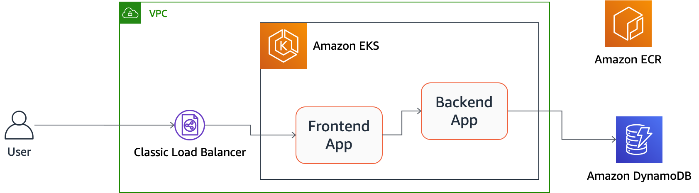
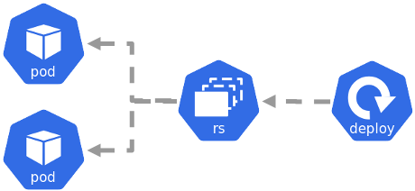
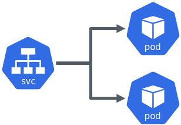
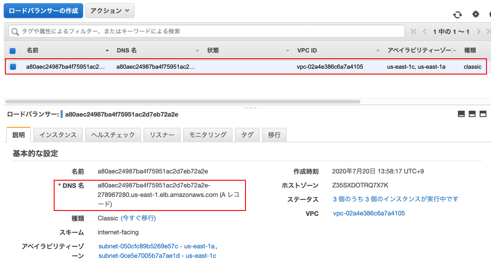
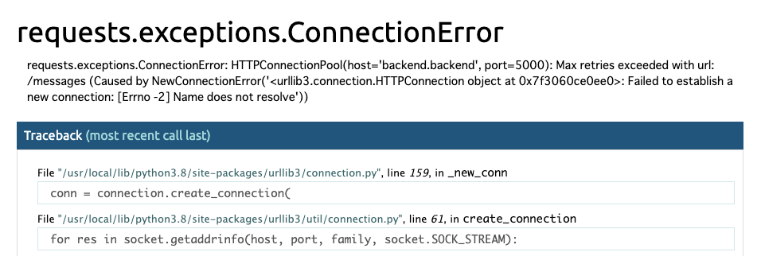
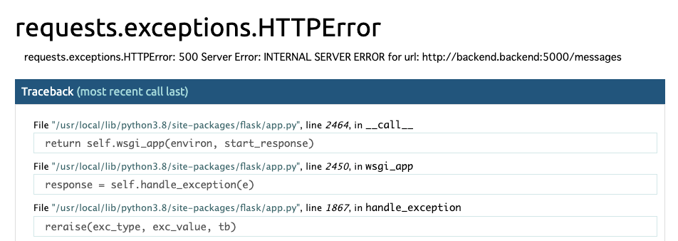
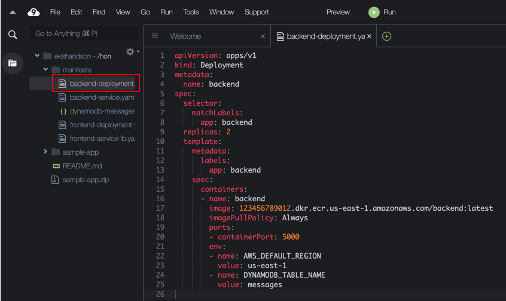

# 샘플 응용 프로그램 배포
이 장에서는 샘플 Web 어플리케이션의 컨테이너 이미지를 빌드하고 Kubernetes 클러스터에서 실행합시다.

실행하는 응용 프로그램은 매우 간단한 게시판 좋아하는 응용 프로그램입니다. 이 응용 프로그램은 Web UI를 제공하는 frontend 응용 프로그램과 API를 제공하는 backend 응용 프로그램의 두 가지 서비스로 이동합니다. backend 응용 프로그램은 DynamoDB에 데이터를 유지합니다.



## DYNAMODB 테이블 만들기
이 절에서는 응용 프로그램 실행을위한 준비로 응용 프로그램이 사용하는 Amazon DynamoDB 테이블을 만들어 보자.

다음 명령을 실행하여 샘플 어플리케이션이 사용하는 DynamoDB 테이블을 작성하십시오.

```
aws dynamodb create-table --table-name 'messages' \
  --attribute-definitions '[{"AttributeName":"uuid","AttributeType": "S"}]' \
  --key-schema '[{"AttributeName":"uuid","KeyType": "HASH"}]' \
  --provisioned-throughput '{"ReadCapacityUnits": 1,"WriteCapacityUnits": 1}'
```

```
{
    "TableDescription": {
        "AttributeDefinitions": [
            {
                "AttributeName": "uuid",
                "AttributeType": "S"
            }
        ],
        "TableName": "messages",
        "KeySchema": [
            {
                "AttributeName": "uuid",
                "KeyType": "HASH"
            }
        ],
        "TableStatus": "CREATING",
        "CreationDateTime": 1594280429.601,
        "ProvisionedThroughput": {
            "NumberOfDecreasesToday": 0,
            "ReadCapacityUnits": 1,
            "WriteCapacityUnits": 1
        },
        "TableSizeBytes": 0,
        "ItemCount": 0,
        "TableArn": "arn:aws:dynamodb:us-east-1:123456789012:table/messages",
        "TableId": "e8f03761-bed9-414f-83d6-ee5c6ae72852"
    }
}
```

## DOCKER 이미지 만들기
이 절에서는 Docker 이미지를 빌드합니다.

디렉토리를 이동하는 경우 ~/environment/디렉토리에 돌아와주세요.

```
cd ~/environment/
```

Cloud9에 응용 프로그램의 소스 코드와 Dockerfile 등을 정리한 zip 파일을 다운로드합니다.

```
wget https://eks-for-aws-summit-online.workshop.aws/sample-app.zip
```

zip 파일을 확장합니다.

```
unzip sample-app.zip
```

Docker 이미지를 빌드합니다. docker-compose를 사용하여 두 개의 응용 프로그램 Docker 이미지를 정리하고 빌드합니다.

```
cd sample-app
docker-compose build
```

다음과 같이 기본 이미지를 pull하여 응용 프로그램의 이미지를 빌드하는 모습이 출력이됩니다.

```
Building frontend
Step 1/8 : FROM python:3-alpine
3-alpine: Pulling from library/python
df20fa9351a1: Pull complete
36b3adc4ff6f: Pull complete
a3758150fe75: Pull complete
164dc99cbd9c: Pull complete
64cc991ba717: Pull complete
Digest: sha256:56beb2f19218315e2527c6f0fd0ced673d578318d29ad0d552485200e872bf09
Status: Downloaded newer image for python:3-alpine
 ---> fbfb63e3c6bb
Step 2/8 : WORKDIR /usr/src/app
 ---> Running in 5f216ca9afd7
Removing intermediate container 5f216ca9afd7
 ---> 3e203847d366
Step 3/8 : COPY requirements.txt ./
 ---> 2bb8c10a96a7
Step 4/8 : RUN pip install --no-cache-dir -r requirements.txt
 ---> Running in 8765a8659abf
Collecting Flask
  Downloading Flask-1.1.2-py2.py3-none-any.whl (94 kB)
Collecting Flask-WTF
  Downloading Flask_WTF-0.14.3-py2.py3-none-any.whl (13 kB)
Collecting requests
  Downloading requests-2.24.0-py2.py3-none-any.whl (61 kB)
Collecting Jinja2>=2.10.1
  Downloading Jinja2-2.11.2-py2.py3-none-any.whl (125 kB)
Collecting click>=5.1
  Downloading click-7.1.2-py2.py3-none-any.whl (82 kB)
Collecting itsdangerous>=0.24
  Downloading itsdangerous-1.1.0-py2.py3-none-any.whl (16 kB)
Collecting Werkzeug>=0.15
  Downloading Werkzeug-1.0.1-py2.py3-none-any.whl (298 kB)
Collecting WTForms
  Downloading WTForms-2.3.1-py2.py3-none-any.whl (169 kB)
Collecting urllib3!=1.25.0,!=1.25.1,<1.26,>=1.21.1
  Downloading urllib3-1.25.9-py2.py3-none-any.whl (126 kB)
Collecting idna<3,>=2.5
  Downloading idna-2.10-py2.py3-none-any.whl (58 kB)
Collecting certifi>=2017.4.17
  Downloading certifi-2020.6.20-py2.py3-none-any.whl (156 kB)
Collecting chardet<4,>=3.0.2
  Downloading chardet-3.0.4-py2.py3-none-any.whl (133 kB)
Collecting MarkupSafe>=0.23
  Downloading MarkupSafe-1.1.1.tar.gz (19 kB)
Building wheels for collected packages: MarkupSafe
  Building wheel for MarkupSafe (setup.py): started
  Building wheel for MarkupSafe (setup.py): finished with status 'done'
  Created wheel for MarkupSafe: filename=MarkupSafe-1.1.1-py3-none-any.whl size=12629 sha256=3d63e89f2f08dfe86b89b2f924c484d2c51ea05ec3e5a60ef24944460228cb1c
  Stored in directory: /tmp/pip-ephem-wheel-cache-dfjf0_hz/wheels/0c/61/d6/4db4f4c28254856e82305fdb1f752ed7f8482e54c384d8cb0e
Successfully built MarkupSafe
Installing collected packages: MarkupSafe, Jinja2, click, itsdangerous, Werkzeug, Flask, WTForms, Flask-WTF, urllib3, idna, certifi, chardet, requests
Successfully installed Flask-1.1.2 Flask-WTF-0.14.3 Jinja2-2.11.2 MarkupSafe-1.1.1 WTForms-2.3.1 Werkzeug-1.0.1 certifi-2020.6.20 chardet-3.0.4 click-7.1.2 idna-2.10 itsdangerous-1.1.0 requests-2.24.0 urllib3-1.25.9
Removing intermediate container 8765a8659abf
 ---> f7392775152f
Step 5/8 : COPY templates/ ./templates/
 ---> 6545a00d47e6
Step 6/8 : COPY app.py ./
 ---> 7219c9be4e11
Step 7/8 : ENV PYTHONUNBUFFERED 1
 ---> Running in 0022cadec426
Removing intermediate container 0022cadec426
 ---> 75a92d824306
Step 8/8 : ENTRYPOINT [ "python", "./app.py" ]
 ---> Running in 6ac22cf2b685
Removing intermediate container 6ac22cf2b685
 ---> adf3e29250f1
Successfully built adf3e29250f1
Successfully tagged frontend:latest
Building backend
Step 1/7 : FROM python:3-alpine
 ---> fbfb63e3c6bb
Step 2/7 : WORKDIR /usr/src/app
 ---> Using cache
 ---> 3e203847d366
Step 3/7 : COPY requirements.txt ./
 ---> 1c1dcea65a51
Step 4/7 : RUN pip install --no-cache-dir -r requirements.txt
 ---> Running in 65c2e0cc56fe
Collecting boto3
  Downloading boto3-1.14.23-py2.py3-none-any.whl (128 kB)
Collecting Flask
  Downloading Flask-1.1.2-py2.py3-none-any.whl (94 kB)
Collecting s3transfer<0.4.0,>=0.3.0
  Downloading s3transfer-0.3.3-py2.py3-none-any.whl (69 kB)
Collecting botocore<1.18.0,>=1.17.23
  Downloading botocore-1.17.23-py2.py3-none-any.whl (6.3 MB)
Collecting jmespath<1.0.0,>=0.7.1
  Downloading jmespath-0.10.0-py2.py3-none-any.whl (24 kB)
Collecting Jinja2>=2.10.1
  Downloading Jinja2-2.11.2-py2.py3-none-any.whl (125 kB)
Collecting itsdangerous>=0.24
  Downloading itsdangerous-1.1.0-py2.py3-none-any.whl (16 kB)
Collecting click>=5.1
  Downloading click-7.1.2-py2.py3-none-any.whl (82 kB)
Collecting Werkzeug>=0.15
  Downloading Werkzeug-1.0.1-py2.py3-none-any.whl (298 kB)
Collecting urllib3<1.26,>=1.20; python_version != "3.4"
  Downloading urllib3-1.25.9-py2.py3-none-any.whl (126 kB)
Collecting python-dateutil<3.0.0,>=2.1
  Downloading python_dateutil-2.8.1-py2.py3-none-any.whl (227 kB)
Collecting docutils<0.16,>=0.10
  Downloading docutils-0.15.2-py3-none-any.whl (547 kB)
Collecting MarkupSafe>=0.23
  Downloading MarkupSafe-1.1.1.tar.gz (19 kB)
Collecting six>=1.5
  Downloading six-1.15.0-py2.py3-none-any.whl (10 kB)
Building wheels for collected packages: MarkupSafe
  Building wheel for MarkupSafe (setup.py): started
  Building wheel for MarkupSafe (setup.py): finished with status 'done'
  Created wheel for MarkupSafe: filename=MarkupSafe-1.1.1-py3-none-any.whl size=12629 sha256=fd406483066902550c6cd4a9b43b1ecca9b0fc2c5ec38552b5308987ed0100c9
  Stored in directory: /tmp/pip-ephem-wheel-cache-ndwwbpfc/wheels/0c/61/d6/4db4f4c28254856e82305fdb1f752ed7f8482e54c384d8cb0e
Successfully built MarkupSafe
Installing collected packages: urllib3, jmespath, six, python-dateutil, docutils, botocore, s3transfer, boto3, MarkupSafe, Jinja2, itsdangerous, click, Werkzeug, Flask
Successfully installed Flask-1.1.2 Jinja2-2.11.2 MarkupSafe-1.1.1 Werkzeug-1.0.1 boto3-1.14.23 botocore-1.17.23 click-7.1.2 docutils-0.15.2 itsdangerous-1.1.0 jmespath-0.10.0 python-dateutil-2.8.1 s3transfer-0.3.3 six-1.15.0 urllib3-1.25.9
Removing intermediate container 65c2e0cc56fe
 ---> fe76d73476fc
Step 5/7 : COPY app.py ./
 ---> 9f6bd3a09c68
Step 6/7 : ENV PYTHONUNBUFFERED 1
 ---> Running in 40d84131b0a5
Removing intermediate container 40d84131b0a5
 ---> 4ec75c79b949
Step 7/7 : ENTRYPOINT [ "python", "./app.py" ]
 ---> Running in e6df9b376b51
Removing intermediate container e6df9b376b51
 ---> eedb0373415e
Successfully built eedb0373415e
Successfully tagged backend:latest
```

빌드 된 이미지를 확인합시다.

```
docker images
```

빌드 된 frontend:latest및 backned:latest이미지와이 이미지의 기본 이미지 인 python:3-alpine이미지를 확인할 수 있습니다. 이외에도 몇 가지 원래 존재했던 이미지가 있습니다 만, 이번 실습에서는 사용하지 않기 때문에 무시해도 상관 없습니다.

```
REPOSITORY          TAG                 IMAGE ID            CREATED              SIZE
backend             latest              eedb0373415e        55 seconds ago       143MB
frontend            latest              adf3e29250f1        About a minute ago   93.6MB
python              3-alpine            fbfb63e3c6bb        6 days ago           80.3MB
...
```

## ECR에 이미지 등록
이 절에서는 생성된 이미지를 AWS의 전체 관리하는 개인 이미지 레지스트리인 Amazon Elastic Container Registry (Amazon ECR)에 업로드합니다.

우선 forntend 응용 프로그램의 ECR 저장소를 만듭니다.

```
aws ecr create-repository --repository-name frontend
```

다음과 같이 생성된 저장소의 URL 등의 정보가 출력됩니다.

```
{
    "repository": {
        "repositoryArn": "arn:aws:ecr:us-east-1:123456789012:repository/frontend",
        "registryId": "123456789012",
        "repositoryName": "frontend",
        "repositoryUri": "123456789012.dkr.ecr.us-east-1.amazonaws.com/frontend",
        "createdAt": 1594281247.0,
        "imageTagMutability": "MUTABLE",
        "imageScanningConfiguration": {
            "scanOnPush": false
        }
    }
}
```

마찬가지로 backend 응용 프로그램의 ECR 저장소를 만들 수 있습니다.

```
aws ecr create-repository --repository-name backend
```

저장소의 URL을 검색하여 변수에 저장해야합니다.

```
frontend_repo=$(aws ecr describe-repositories --repository-names frontend --query 'repositories[0].repositoryUri' --output text)
backend_repo=$(aws ecr describe-repositories --repository-names backend --query 'repositories[0].repositoryUri' --output text)
```

ECR에 이미지를 push하기 위해서는 이미지 저장소 이름을 ECR 저장소? URL을해야합니다. 방금 빌드 한 이미지에 ECR 저장소의 URL 이름으로 별명을 붙입니다.

```
docker tag frontend:latest ${frontend_repo}:latest
docker tag backend:latest ${backend_repo}:latest
```

별명을 붙인 이미지를 확인합시다.

```
docker images
```

같은 이미지 ID에 ECR 저장소 이름이 부여된 별명이 생성 된 것을 확인할 수 있습니다.

```
REPOSITORY                                              TAG                 IMAGE ID            CREATED             SIZE
backend                                                 latest              eedb0373415e        3 minutes ago       143MB
123456789012.dkr.ecr.us-east-1.amazonaws.com/backend    latest              eedb0373415e        3 minutes ago       143MB
123456789012.dkr.ecr.us-east-1.amazonaws.com/frontend   latest              adf3e29250f1        3 minutes ago       93.6MB
frontend                                                latest              adf3e29250f1        3 minutes ago       93.6MB
python                                                  3-alpine            fbfb63e3c6bb        6 days ago          80.3MB
...
```

이미지를 ECR에 push하기 위해 ECR에 로그인합니다.

```
ACCOUNT_ID=$(aws sts get-caller-identity --output text --query Account)
AWS_REGION=$(aws configure get default.region)
aws ecr get-login-password | docker login --username AWS --password-stdin https://${ACCOUNT_ID}.dkr.ecr.${AWS_REGION}.amazonaws.com
```

Login Succeeded 표시되면 로그인 성공입니다.

```
WARNING! Your password will be stored unencrypted in /home/ec2-user/.docker/config.json.
Configure a credential helper to remove this warning. See
https://docs.docker.com/engine/reference/commandline/login/#credentials-store

Login Succeeded
```

이전 ECR에 로그인 할 때 aws ecr get-login명령을 사용했지만 현재는 aws ecr get-login-password명령이 권장됩니다.

frontend 응용 프로그램의 이미지를 ECR에 push합니다.

```
docker push ${frontend_repo}:latest
```

다음과 같이 표시하면 업로드가 성공합니다.

```
The push refers to repository [123456789012.dkr.ecr.us-east-1.amazonaws.com/frontend]
0d6c3efae52d: Pushed 
62e5e741d664: Pushed 
6402a2648ecb: Pushed 
54d60a50cd06: Pushed 
56c58b4adb88: Pushed 
3c311c80eeb3: Pushed 
b99c289e09b9: Pushed 
fbbc22a9fb49: Pushed 
408e53c5e3b2: Pushed 
50644c29ef5a: Pushed 
latest: digest: sha256:4dbd75426f8f7861053b3b983a8a19f3ce1021b6b53da5b923a9a281b05be777 size: 2407
```

마찬가지로 backend 프로그램도 ECR에 push하십시오.

```
docker push ${backend_repo}:latest
```

## FRONTEND 응용 프로그램 배포
이 절에서는 frontend 응용 프로그램을 배포합니다.

작업 디렉토리를 생성하고 이동합니다.

```
mkdir -p ~/environment/manifests/
cd ~/environment/manifests/
```

### Namespace 만들기
frontend 응용 프로그램의 Namespace를 작성합시다. 기본 Namespace도 변경합니다. 다음 명령을 실행합니다.

```
kubectl create namespace frontend
kubens frontend
```

frontend와 backend 두 응용 프로그램을 같은 Namespace에 배치 할 수 있습니다 만, 이번은 각각 다른 Namespace에 배치합니다.

### Deployment 만들기
Pod를 단독으로 배포 할 수도 있지만 일반적으로 Deployment자원을 사용하여 배포합니다. Deployment 자원 정의 파일을 작성합시다. YAML 또는 JSON 형식이 정의 파일은 Kubernetes 매니페스트라고합니다.

```
frontend_repo=$(aws ecr describe-repositories --repository-names frontend --query 'repositories[0].repositoryUri' --output text)
cat <<EOF > frontend-deployment.yaml
apiVersion: apps/v1
kind: Deployment
metadata:
  name: frontend
spec:
  selector:
    matchLabels:
      app: frontend
  replicas: 2
  template:
    metadata:
      labels:
        app: frontend
    spec:
      containers:
      - name: frontend
        image: ${frontend_repo}:latest
        imagePullPolicy: Always
        ports:
        - containerPort: 5000
        env:
        - name: BACKEND_URL
          value: http://backend.backend:5000/messages
EOF
```

- spec.replica 부분이 필요로하는 Pod 수 (복제)입니다

- spec.template 부분이 Pod 정의 템플릿

- spec.template.metadata.labels부분 Pod에 app=frontend레이블을 부여하고 있습니다

- spec.template.spec.containers[].image 부분이 Docker 이미지 지정합니다

- spec.template.spec.containers[].env[] 부분에서 backend 응용 프로그램의 URL을 환경 변수로 정의하고 있습니다

이 매니페스트를 apply하고 Deployment를 작성합시다.

```
kubectl apply -f frontend-deployment.yaml -n frontend
```

이처럼 Kubernetes에서 응용 프로그램의 배포 작업은 매니페스트 생성 및 생성 된 매니페스트의 apply는 조작이 기본이됩니다.

작성한 Deployment를 확인합시다.

```
kubectl get deployment -n frontend
```

```
NAME       READY   UP-TO-DATE   AVAILABLE   AGE
frontend   2/2     2            2           9s
```

Deployment 자원을 작성한 것으로, Deployment 자원의 정의 내용에 따라 자동으로 Pod가 생성됩니다.

```
정확히Deployment 자원이 ReplicaSet 자원이 생성되고 ReplicaSet 자원이 Pod가 생성됩니다.
```



Pod를 확인합시다.

```
kubectl get pod -n frontend
```

STATUS 열 Running이 있으면 성공적으로 시작하고 있습니다. Running되어 있지 않은 경우는 조금 시간을두고 다시 명령을 실행하십시오. 여러 번 실행해도 Running되지 않는 경우 절차를 잘못되지 않았는지 다시 확인하십시오.

```
NAME                        READY   STATUS    RESTARTS   AGE
frontend-787b87c486-kggsm   1/1     Running   0          76s
frontend-787b87c486-tk694   1/1     Running   0          76s
```

### Service 만들기
Deployment 의해 시작되었다 Pod 군에 액세스하기 위해 이름 확인 및 부하 분산 기능을 제공하는 것이 Service 자원입니다.



Service 자원에 type: ClusterIP및 버튼 type: NodePort등 일부유형있지만, EKS에서 type: LoadBalancer사용하면 Classic Load Balancer를 자동으로 제공하여 클러스터 외부에서 응용 프로그램에 액세스 할 수 있습니다.

Service의 명단을 작성합시다.

```
cat <<EOF > frontend-service-lb.yaml
apiVersion: v1
kind: Service
metadata:
  name: frontend
spec:
  type: LoadBalancer
  selector:
    app: frontend
  ports:
  - protocol: TCP
    port: 80
    targetPort: 5000
EOF
```

- spec.type로 LoadBalancer를 지정하고 있습니다

- spec.selector부분에 지정된 라벨 ( app=frontend)을 가지는 Pod이 Service에서 할당 대상이됩니다
이 매니페스트를 apply하여 Service를 작성합시다.

```
kubectl apply -f frontend-service-lb.yaml -n frontend
```

작성한 Service를 확인합시다.

```
kubectl get service -n frontend
```

다음과 같이 작성한 Service가 표시됩니다.

```
NAME       TYPE           CLUSTER-IP     EXTERNAL-IP                                                              PORT(S)        AGE
frontend   LoadBalancer   10.100.36.92   a80aec24987ba4f75951ac2d7eb72a2e-278967280.us-east-1.elb.amazonaws.com   80:32143/TCP   7s
```

이 때, Classic Load Balancer가 자동으로 작성되어 있습니다. 관리 콘솔을 열고 자동으로 생성 된 Classic Load Balancer를 확인해주세요.



EXTERNAL-IP 열에 표시되는 호스트 이름 (또는 관리 콘솔의 Classic Load Balancer의 DNS 이름)에 액세스하여 응용 프로그램에 액세스 할 수 있습니다.

Classic Load Balancer가 생성 된 후 이름 확인을 할 수있게되기까지 몇 분 정도의 시간이 걸립니다. 없다면, 이름 확인을 할 수있게 될 때까지 잠시 기다려보세요.

액세스 할 수 있지만 오류가 되돌아옵니다. 오류 메시지에 따르면, backend 응용 프로그램에 연결하려고 이름 확인에 실패하고있는 것 같습니다.



Pod의 로그를 확인합시다. 먼저 Pod 이름을 확인합니다.

```
kubectl get pod -n frontend
```

가장 왼쪽 열에 표시되는 Pod 이름을 클립 보드에 복사합니다. Pod가 2 개의 가동하고 있기 때문에 각각의 로그를 확인해야합니다.

```
NAME                        READY   STATUS    RESTARTS   AGE
frontend-787b87c486-kggsm   1/1     Running   0          103s
frontend-787b87c486-tk694   1/1     Running   0          103s
```

Pod의 이름을 지정하고 로그를 확인합니다.

```
kubectl logs -n frontend <Pod Name>
```

어느 Pod 로그에서 다음과 같은 오류를 확인할 수있는 것입니다.

```
requests.exceptions.ConnectionError: HTTPConnectionPool(host='backend.backend', port=5000): Max retries exceeded with url: /messages (Caused by NewConnectionError('<urllib3.connection.HTTPConnection object at 0x7fe0878a8a60>: Failed to establish a new connection: [Errno -2] Name does not resolve'))
```

여러 Pod에 걸쳐 로그의 확인은 조금 복잡하지만,이 작업을 용이하게 해주는 것이 편리 도구로 도입 한 [stern](https://github.com/wercker/stern) 입니다.

인수 Pod 이름의 정규 표현식을 사용하여 실행합니다.

```
stern frontend -n frontend
```

다음과 같이 여러 Pod에 걸쳐 로그를 확인 할 수 있습니다.

```
+ frontend-787b87c486-tk694 › frontend
+ frontend-787b87c486-kggsm › frontend
frontend-787b87c486-kggsm frontend  * Serving Flask app "app" (lazy loading)
frontend-787b87c486-kggsm frontend  * Environment: production
frontend-787b87c486-kggsm frontend    WARNING: This is a development server. Do not use it in a production deployment.
frontend-787b87c486-kggsm frontend    Use a production WSGI server instead.
frontend-787b87c486-kggsm frontend  * Debug mode: on
frontend-787b87c486-kggsm frontend  * Running on http://0.0.0.0:5000/ (Press CTRL+C to quit)
frontend-787b87c486-kggsm frontend  * Restarting with stat
frontend-787b87c486-kggsm frontend  * Debugger is active!
frontend-787b87c486-kggsm frontend  * Debugger PIN: 166-109-890
frontend-787b87c486-kggsm frontend 192.168.48.84 - - [20/Jul/2020 05:13:13] "GET /?__debugger__=yes&cmd=resource&f=style.css HTTP/1.1" 200 -
frontend-787b87c486-kggsm frontend 192.168.48.84 - - [20/Jul/2020 05:13:14] "GET /?__debugger__=yes&cmd=resource&f=ubuntu.ttf HTTP/1.1" 200 -
frontend-787b87c486-kggsm frontend 192.168.48.84 - - [20/Jul/2020 05:13:14] "GET /?__debugger__=yes&cmd=resource&f=console.png HTTP/1.1" 200 -
frontend-787b87c486-kggsm frontend 192.168.48.84 - - [20/Jul/2020 05:13:15] "GET /?__debugger__=yes&cmd=resource&f=console.png HTTP/1.1" 200 -
frontend-787b87c486-tk694 frontend  * Serving Flask app "app" (lazy loading)
frontend-787b87c486-tk694 frontend  * Environment: production
frontend-787b87c486-tk694 frontend    WARNING: This is a development server. Do not use it in a production deployment.
frontend-787b87c486-tk694 frontend    Use a production WSGI server instead.
frontend-787b87c486-tk694 frontend  * Debug mode: on
frontend-787b87c486-tk694 frontend  * Running on http://0.0.0.0:5000/ (Press CTRL+C to quit)
frontend-787b87c486-tk694 frontend  * Restarting with stat
frontend-787b87c486-tk694 frontend  * Debugger is active!
frontend-787b87c486-tk694 frontend  * Debugger PIN: 172-938-675
frontend-787b87c486-tk694 frontend 192.168.48.84 - - [20/Jul/2020 05:13:12] "GET / HTTP/1.1" 500 -
frontend-787b87c486-tk694 frontend Traceback (most recent call last):
frontend-787b87c486-tk694 frontend   File "/usr/local/lib/python3.8/site-packages/urllib3/connection.py", line 159, in _new_conn
frontend-787b87c486-tk694 frontend     conn = connection.create_connection(
frontend-787b87c486-tk694 frontend   File "/usr/local/lib/python3.8/site-packages/urllib3/util/connection.py", line 61, in create_connection
frontend-787b87c486-tk694 frontend     for res in socket.getaddrinfo(host, port, family, socket.SOCK_STREAM):
frontend-787b87c486-tk694 frontend   File "/usr/local/lib/python3.8/socket.py", line 918, in getaddrinfo
frontend-787b87c486-tk694 frontend     for res in _socket.getaddrinfo(host, port, family, type, proto, flags):
frontend-787b87c486-tk694 frontend socket.gaierror: [Errno -2] Name does not resolve
frontend-787b87c486-tk694 frontend 
frontend-787b87c486-tk694 frontend During handling of the above exception, another exception occurred:
frontend-787b87c486-tk694 frontend 
frontend-787b87c486-tk694 frontend Traceback (most recent call last):
frontend-787b87c486-tk694 frontend   File "/usr/local/lib/python3.8/site-packages/urllib3/connectionpool.py", line 670, in urlopen
frontend-787b87c486-tk694 frontend     httplib_response = self._make_request(
frontend-787b87c486-tk694 frontend   File "/usr/local/lib/python3.8/site-packages/urllib3/connectionpool.py", line 392, in _make_request
frontend-787b87c486-tk694 frontend     conn.request(method, url, **httplib_request_kw)
frontend-787b87c486-tk694 frontend   File "/usr/local/lib/python3.8/http/client.py", line 1240, in request
frontend-787b87c486-tk694 frontend     self._send_request(method, url, body, headers, encode_chunked)
frontend-787b87c486-tk694 frontend   File "/usr/local/lib/python3.8/http/client.py", line 1286, in _send_request
frontend-787b87c486-tk694 frontend     self.endheaders(body, encode_chunked=encode_chunked)
frontend-787b87c486-tk694 frontend   File "/usr/local/lib/python3.8/http/client.py", line 1235, in endheaders
frontend-787b87c486-tk694 frontend     self._send_output(message_body, encode_chunked=encode_chunked)
frontend-787b87c486-tk694 frontend   File "/usr/local/lib/python3.8/http/client.py", line 1006, in _send_output
frontend-787b87c486-tk694 frontend     self.send(msg)
frontend-787b87c486-tk694 frontend   File "/usr/local/lib/python3.8/http/client.py", line 946, in send
frontend-787b87c486-tk694 frontend     self.connect()
frontend-787b87c486-tk694 frontend   File "/usr/local/lib/python3.8/site-packages/urllib3/connection.py", line 187, in connect
frontend-787b87c486-tk694 frontend     conn = self._new_conn()
frontend-787b87c486-tk694 frontend   File "/usr/local/lib/python3.8/site-packages/urllib3/connection.py", line 171, in _new_conn
frontend-787b87c486-tk694 frontend     raise NewConnectionError(
frontend-787b87c486-tk694 frontend urllib3.exceptions.NewConnectionError: <urllib3.connection.HTTPConnection object at 0x7fc4a862cfd0>: Failed to establish a new connection: [Errno -2] Name does not resolve
frontend-787b87c486-tk694 frontend 
frontend-787b87c486-tk694 frontend During handling of the above exception, another exception occurred:
frontend-787b87c486-tk694 frontend 
frontend-787b87c486-tk694 frontend Traceback (most recent call last):
frontend-787b87c486-tk694 frontend   File "/usr/local/lib/python3.8/site-packages/requests/adapters.py", line 439, in send
frontend-787b87c486-tk694 frontend     resp = conn.urlopen(
frontend-787b87c486-tk694 frontend   File "/usr/local/lib/python3.8/site-packages/urllib3/connectionpool.py", line 724, in urlopen
frontend-787b87c486-tk694 frontend     retries = retries.increment(
frontend-787b87c486-tk694 frontend   File "/usr/local/lib/python3.8/site-packages/urllib3/util/retry.py", line 439, in increment
frontend-787b87c486-tk694 frontend     raise MaxRetryError(_pool, url, error or ResponseError(cause))
frontend-787b87c486-tk694 frontend urllib3.exceptions.MaxRetryError: HTTPConnectionPool(host='backend.backend', port=5000): Max retries exceeded with url: /messages (Caused by NewConnectionError('<urllib3.connection.HTTPConnection object at 0x7fc4a862cfd0>: Failed to establish a new connection: [Errno -2] Name does not resolve'))
frontend-787b87c486-tk694 frontend 
frontend-787b87c486-tk694 frontend During handling of the above exception, another exception occurred:
frontend-787b87c486-tk694 frontend 
frontend-787b87c486-tk694 frontend Traceback (most recent call last):
frontend-787b87c486-tk694 frontend   File "/usr/local/lib/python3.8/site-packages/flask/app.py", line 2464, in __call__
frontend-787b87c486-tk694 frontend     return self.wsgi_app(environ, start_response)
frontend-787b87c486-tk694 frontend   File "/usr/local/lib/python3.8/site-packages/flask/app.py", line 2450, in wsgi_app
frontend-787b87c486-tk694 frontend     response = self.handle_exception(e)
frontend-787b87c486-tk694 frontend   File "/usr/local/lib/python3.8/site-packages/flask/app.py", line 1867, in handle_exception
frontend-787b87c486-tk694 frontend     reraise(exc_type, exc_value, tb)
frontend-787b87c486-tk694 frontend   File "/usr/local/lib/python3.8/site-packages/flask/_compat.py", line 39, in reraise
frontend-787b87c486-tk694 frontend     raise value
frontend-787b87c486-tk694 frontend   File "/usr/local/lib/python3.8/site-packages/flask/app.py", line 2447, in wsgi_app
frontend-787b87c486-tk694 frontend     response = self.full_dispatch_request()
frontend-787b87c486-tk694 frontend   File "/usr/local/lib/python3.8/site-packages/flask/app.py", line 1952, in full_dispatch_request
frontend-787b87c486-tk694 frontend     rv = self.handle_user_exception(e)
frontend-787b87c486-tk694 frontend   File "/usr/local/lib/python3.8/site-packages/flask/app.py", line 1821, in handle_user_exception
frontend-787b87c486-tk694 frontend     reraise(exc_type, exc_value, tb)
frontend-787b87c486-tk694 frontend   File "/usr/local/lib/python3.8/site-packages/flask/_compat.py", line 39, in reraise
frontend-787b87c486-tk694 frontend     raise value
frontend-787b87c486-tk694 frontend   File "/usr/local/lib/python3.8/site-packages/flask/app.py", line 1950, in full_dispatch_request
frontend-787b87c486-tk694 frontend     rv = self.dispatch_request()
frontend-787b87c486-tk694 frontend   File "/usr/local/lib/python3.8/site-packages/flask/app.py", line 1936, in dispatch_request
frontend-787b87c486-tk694 frontend     return self.view_functions[rule.endpoint](**req.view_args)
frontend-787b87c486-tk694 frontend   File "/usr/src/app/app.py", line 25, in home_page
frontend-787b87c486-tk694 frontend     r = requests.get(backend_url)
frontend-787b87c486-tk694 frontend   File "/usr/local/lib/python3.8/site-packages/requests/api.py", line 76, in get
frontend-787b87c486-tk694 frontend     return request('get', url, params=params, **kwargs)
frontend-787b87c486-tk694 frontend   File "/usr/local/lib/python3.8/site-packages/requests/api.py", line 61, in request
frontend-787b87c486-tk694 frontend     return session.request(method=method, url=url, **kwargs)
frontend-787b87c486-tk694 frontend   File "/usr/local/lib/python3.8/site-packages/requests/sessions.py", line 530, in request
frontend-787b87c486-tk694 frontend     resp = self.send(prep, **send_kwargs)
frontend-787b87c486-tk694 frontend   File "/usr/local/lib/python3.8/site-packages/requests/sessions.py", line 643, in send
frontend-787b87c486-tk694 frontend     r = adapter.send(request, **kwargs)
frontend-787b87c486-tk694 frontend   File "/usr/local/lib/python3.8/site-packages/requests/adapters.py", line 516, in send
frontend-787b87c486-tk694 frontend     raise ConnectionError(e, request=request)
frontend-787b87c486-tk694 frontend requests.exceptions.ConnectionError: HTTPConnectionPool(host='backend.backend', port=5000): Max retries exceeded with url: /messages (Caused by NewConnectionError('<urllib3.connection.HTTPConnection object at 0x7fc4a862cfd0>: Failed to establish a new connection: [Errno -2] Name does not resolve'))
frontend-787b87c486-tk694 frontend 192.168.48.84 - - [20/Jul/2020 05:13:13] "GET /?__debugger__=yes&cmd=resource&f=debugger.js HTTP/1.1" 200 -
frontend-787b87c486-tk694 frontend 192.168.48.84 - - [20/Jul/2020 05:13:13] "GET /?__debugger__=yes&cmd=resource&f=jquery.js HTTP/1.1" 200 -
```

tail 상태로되어 있기 때문에, Ctrl + C를 종료하십시오.

frontend 응용 프로그램이 연결을 시도하고있다 backend 프로그램을 아직 배포하지 않기 때문에이 오류는 당연합니다. 다음 절에서는 backend 응용 프로그램을 전개합시다.

## BACKEND 앱 배포
이 절에서는 backend 응용 프로그램을 배포합니다.

### Namespace 만들기
backend 응용 프로그램의 Namespace를 작성합시다. 다음 명령을 실행합니다.

```
kubectl create namespace backend
kubens backend
```

### Deployment 만들기
Deployment를 정의한 Kubernetes 매니페스트를 만듭니다.

```
AWS_REGION=$(aws configure get default.region)
backend_repo=$(aws ecr describe-repositories --repository-names backend --query 'repositories[0].repositoryUri' --output text)
cat <<EOF > backend-deployment.yaml
apiVersion: apps/v1
kind: Deployment
metadata:
  name: backend
spec:
  selector:
    matchLabels:
      app: backend
  replicas: 2
  template:
    metadata:
      labels:
        app: backend
    spec:
      containers:
      - name: backend
        image: ${backend_repo}:latest
        imagePullPolicy: Always
        ports:
        - containerPort: 5000
        env:
        - name: AWS_DEFAULT_REGION
          value: ${AWS_REGION}
        - name: DYNAMODB_TABLE_NAME
          value: messages
EOF
```

- spec.template.spec.containers[].env[] 부분 DynamoDB의 지역이나 테이블 이름을 환경 변수로 정의하고 있습니다

이 매니페스트를 apply하고 Deployment를 작성합시다.

```
kubectl apply -f backend-deployment.yaml -n backend
```

Pod를 확인합시다.

```
kubectl get pod -n backend
```

STATUS 열 Running이 있으면 성공적으로 시작하고 있습니다. Running 되어 있지 않은 경우는 조금 시간을두고 다시 명령을 실행하십시오. 여러 번 실행해도 Running 되지 않는 경우 절차를 잘못되지 않았는지 다시 확인하십시오.

```
NAME                       READY   STATUS    RESTARTS   AGE
backend-56545567fb-cbzs2   1/1     Running   0          10s
backend-56545567fb-grvgd   1/1     Running   0          10s
```

### Service 만들기
backend 응용 프로그램 Service를 만듭니다. 이 응용 프로그램은 클러스터 외부에 공개 할 필요가 없기 때문에 type: ClusterIP의 Service를 작성하고 클러스터에만 공개합니다.

매니페스트를 만듭니다.

```
cat <<EOF > backend-service.yaml
apiVersion: v1
kind: Service
metadata:
  name: backend
spec:
  type: ClusterIP
  selector:
    app: backend
  ports:
  - protocol: TCP
    port: 5000
    targetPort: 5000
EOF
```

- 동일 Namespace의 Pod에서는 metadata.name로 지정되어있는 Service의 이름이 Service에 액세스 할 수 있습니다
  - 다른 Namespace의 Pod부터는 <Service名>.<Namespace名>에서이 Service에 액세스 할 수 있습니다

이 매니페스트를 apply하여 Service를 작성합시다.

```
kubectl apply -f backend-service.yaml -n backend
```

작성한 Service를 확인합시다.

```
kubectl get service -n backend
```

```
NAME      TYPE        CLUSTER-IP      EXTERNAL-IP   PORT(S)    AGE
backend   ClusterIP   10.100.66.162   <none>        5000/TCP   23s
```

backend 응용 프로그램을 전개 할 수 있기 때문에, frontend 응용 프로그램에 다시 액세스 해보세요.

DNS 이름을 확인하려면 다음 명령을 실행합니다.

```
kubectl get service -n frontend
```

액세스하면 오류가 바뀌 었 습니다만, 역시 오류입니다. backend 응용 프로그램에서 500 오류를 반환하는 것입니다.



backend 응용 프로그램 로그를 확인합시다.

```
stern backend --since 3m -n backend
```

- --since 옵션을 사용하여 최근의 3 분의 로그를 대상으로하고 있습니다

- 기타 옵션 stern --help에서 확인할 수 있습니다

로그 메시지에서 DynamoDB에 액세스하는 권한 문제가 발생하고있는 것을 알 수 있습니다.

```
backend-56545567fb-grvgd backend botocore.exceptions.ClientError: An error occurred (AccessDeniedException) when calling the Scan operation: User: arn:aws:sts::123456789012:assumed-role/eksctl-ekshandson-nodegroup-ng-39-NodeInstanceRole-1ESHEVV1331TG/i-08f9117c1fc0e990c is not authorized to perform: dynamodb:Scan on resource: arn:aws:dynamodb:us-east-1:875522380455:table/messages
```

다음 절에서는 backend 프로그램에 DynamoDB에 대한 액세스 권한을 부여하자.

## IAM ROLES FOR SERVICE ACCOUNTS
이 절에서는IAM Roles for Service Accounts (IRSA) 라는 EKS 기능을 사용하여 backend 응용 프로그램의 Pod에 IAM 역할을 부여하고 DynamoDB에 대한 액세스를 허용합니다.

### OIDC 제공자 작성
OIDC ID 공급자를 만듭니다 클러스터에 연결합니다. eksctl를 사용하면 쉽게 할 수 있습니다. 다음 명령을 실행하십시오.

```
eksctl utils associate-iam-oidc-provider \
    --cluster ekshandson \
    --approve
```

다음과 같은 메시지가 출력됩니다.

```
[ℹ]  eksctl version 0.24.0
[ℹ]  using region us-east-1
[ℹ]  will create IAM Open ID Connect provider for cluster "ekshandson" in "us-east-1"
[✔]  created IAM Open ID Connect provider for cluster "ekshandson" in "us-east-1"
```

```
IAM 콘솔을 열고 메뉴에서 ID 공급자를 선택하면 eksctl 의해 생성 된 ID 공급자를 확인할 수 있습니다.
```

### IAM 정책 만들기
먼저 DynamoDB의 messages테이블에 모든 권한을 부여하는 IAM 정책을 만듭니다.

IAM 정책 정의 파일을 만듭니다.

```
cat <<EOF > dynamodb-messages-fullaccess-policy.json
{
    "Version": "2012-10-17",
    "Statement": [
        {
            "Sid": "ListAndDescribe",
            "Effect": "Allow",
            "Action": [
                "dynamodb:List*",
                "dynamodb:DescribeReservedCapacity*",
                "dynamodb:DescribeLimits",
                "dynamodb:DescribeTimeToLive"
            ],
            "Resource": "*"
        },
        {
            "Sid": "SpecificTable",
            "Effect": "Allow",
            "Action": [
                "dynamodb:BatchGet*",
                "dynamodb:DescribeStream",
                "dynamodb:DescribeTable",
                "dynamodb:Get*",
                "dynamodb:Query",
                "dynamodb:Scan",
                "dynamodb:BatchWrite*",
                "dynamodb:CreateTable",
                "dynamodb:Delete*",
                "dynamodb:Update*",
                "dynamodb:PutItem"
            ],
            "Resource": "arn:aws:dynamodb:*:*:table/messages"
        }
    ]
}
EOF
```

IAM 정책을 만들 수 있습니다.

```
aws iam create-policy \
    --policy-name dynamodb-messages-fullaccess \
    --policy-document file://dynamodb-messages-fullaccess-policy.json
```

```
{
    "Policy": {
        "PolicyName": "dynamodb-messages-fullaccess",
        "PolicyId": "ANPAQJQWSUX3N6RVGORO3",
        "Arn": "arn:aws:iam::123456789012:policy/dynamodb-messages-fullaccess",
        "Path": "/",
        "DefaultVersionId": "v1",
        "AttachmentCount": 0,
        "PermissionsBoundaryUsageCount": 0,
        "IsAttachable": true,
        "CreateDate": "2020-07-09T08:52:23Z",
        "UpdateDate": "2020-07-09T08:52:23Z"
    }
}
```

### IAM 역할과 ServiceAccount 만들기
backend 응용 프로그램을 실행하는 데 사용하는 ServiceAccount와 IAM 역할을 생성하고 연결합니다. 이 작업을 eksctl사용하면 쉽게 할 수 있습니다. 다음 명령을 실행하십시오.

```
ACCOUNT_ID=$(aws sts get-caller-identity --output text --query Account)
eksctl create iamserviceaccount \
    --name dynamodb-messages-fullaccess \
    --namespace backend \
    --cluster ekshandson \
    --attach-policy-arn arn:aws:iam::${ACCOUNT_ID}:policy/dynamodb-messages-fullaccess \
    --override-existing-serviceaccounts \
    --approve
```

다음과 같은 메시지가 출력됩니다.

```
[ℹ]  eksctl version 0.24.0
[ℹ]  using region us-east-1
[ℹ]  1 iamserviceaccount (backend/dynamodb-messages-fullaccess) was included (based on the include/exclude rules)
[!]  metadata of serviceaccounts that exist in Kubernetes will be updated, as --override-existing-serviceaccounts was set
[ℹ]  1 task: { 2 sequential sub-tasks: { create IAM role for serviceaccount "backend/dynamodb-messages-fullaccess", create serviceaccount "backend/dynamodb-messages-fullaccess" } }
[ℹ]  building iamserviceaccount stack "eksctl-ekshandson-addon-iamserviceaccount-backend-dynamodb-messages-fullaccess"
[ℹ]  deploying stack "eksctl-ekshandson-addon-iamserviceaccount-backend-dynamodb-messages-fullaccess"
[ℹ]  created serviceaccount "backend/dynamodb-messages-fullaccess"
```

```
이 때 eksctl은 CloudFormation을 사용하여 IAM 역할을 생성하고 Kubernetes 클러스터에서 ServiceAccount 자원을 작성합니다.
```

작성된 ServiceAccount 확인합시다.

```
kubectl get serviceaccount -n backend
```

default라는 ServiceAccount는 Namespace를 작성할 때 자동으로 작성됩니다. Pod 실행시 ServiceAccout을 명시 적으로 지정하지 않으면이 defaultServiceAccount의 권한으로 실행됩니다. dynamodb-messages-fullaccess라는 ServiceAccount가 지금 만든 ServiceAccount입니다.

```
NAME                           SECRETS   AGE
default                        1         7m29s
dynamodb-messages-fullaccess   1         38s
```

이 dynamodb-messages-fullaccess라는 ServiceAccount의 내용을 확인합시다.

```
kubectl describe serviceaccount dynamodb-messages-fullaccess -n backend
```

IAM 역할과 연결하는 어노테이션이 부여되어있는 것을 확인할 수 있습니다.

```
Name:                dynamodb-messages-fullaccess
Namespace:           backend
Labels:              <none>
Annotations:         eks.amazonaws.com/role-arn: arn:aws:iam::123456789012:role/eksctl-ekshandson-addon-iamserviceaccount-ba-Role1-1WOU061V2S3QT
Image pull secrets:  <none>
Mountable secrets:   dynamodb-messages-fullaccess-token-lb9wn
Tokens:              dynamodb-messages-fullaccess-token-lb9wn
Events:              <none>

```
### Deployment 수정
backend 응용 프로그램의 Deployment의 정의를 수정하여 만든 ServiceAccount에서 Pod를 실행하도록합니다.

Cloud9에서 backend-deployment.yaml을 두 번 클릭하여 엽니다.



다음과 같이 serviceAccountName지정을 추가 Ctrl + S로 저장합니다.

```
apiVersion: apps/v1
kind: Deployment
metadata:
  name: backend
spec:
  selector:
    matchLabels:
      app: backend
  replicas: 2
  template:
    metadata:
      labels:
        app: backend
    spec:
+     serviceAccountName: dynamodb-messages-fullaccess
      containers:
      - name: backend
        image: 123456789012.dkr.ecr.us-east-1.amazonaws.com/backend:latest
        imagePullPolicy: Always
        ports:
        - containerPort: 5000
        env:
        - name: AWS_DEFAULT_REGION
          value: us-east-1
        - name: DYNAMODB_TABLE_NAME
          value: messages
```

수정된 매니페스트를 apply합시다.

```
kubectl apply -f backend-deployment.yaml -n backend
```

자동으로 새로운 Pod가 시작되므로 확인합시다.

```
kubectl get pod -n backend
```

Pod 이름이 바뀌고, 또한 AGE 열의 값도 리셋되어 작아 져있을 것입니다.

```
NAME                       READY   STATUS    RESTARTS   AGE
backend-5fb99fd956-kc7zb   1/1     Running   0          8s
backend-5fb99fd956-mgbcr   1/1     Running   0          10s
```

시작 확인
다시 frontend 응용 프로그램에 액세스하여 봅시다.

DNS 이름을 확인하려면 다음 명령을 실행합니다.

```
kubectl get service -n frontend
```

축하합니다! 다음과 같은 응용 프로그램이 표시되면 성공입니다.


메시지를 DynamoDB에 저장하는 게시판 좋아하는 간단한 응용 프로그램입니다. 텍스트 상자에 뭔가 메시지를 넣고 Submit 버튼을 눌러보세요.

